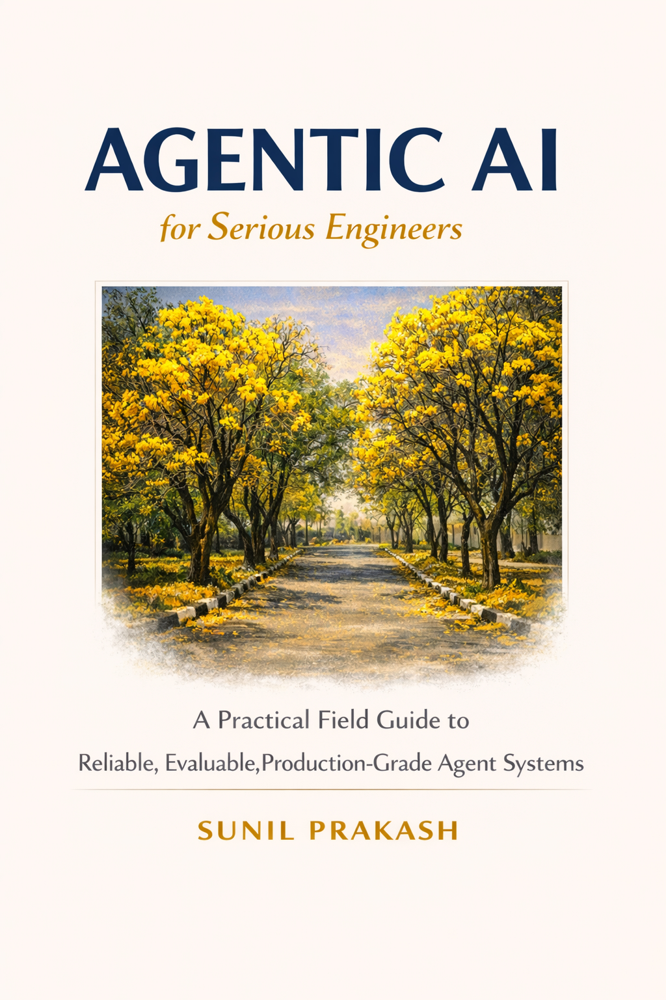

# Agentic AI for Serious Engineers

<p align="center">
  
</p>

<p align="center">
  <a href="https://www.amazon.com/dp/B0GVG6848F"></a>
  <a href="https://github.com/sunilp/agentic-ai"></a>
</p>

**A practical field guide to building reliable, evaluable, and production-grade agent systems.**

**[Get the book on Amazon](https://www.amazon.com/dp/B0GVG6848F)** | **[Read the companion site](https://sunilprakash.com/agentic-ai/)**

---

This repository is the **code companion** to *Agentic AI for Serious Engineers*. It contains working Python implementations, architecture diagrams, evaluation harnesses, and end-to-end projects that accompany the book.

The book teaches you when to build an agent, when not to, and how to make the ones you build survive production. The code here lets you run every concept hands-on.

## New to agentic AI?

Start with the **Foundations** -- five hands-on sections that take you from zero to building your first agent and connecting it to tools via MCP.

| # | Section | What you learn |
|---|---------|----------------|
| 0a | [How LLMs Actually Work](docs/book/00a-how-llms-work.md) | The engineer's mental model: APIs, tokens, context, hallucination |
| 0b | [From API Calls to Tool Use](docs/book/00b-api-to-tools.md) | Function calling, schema validation, giving the model hands |
| 0c | [Your First Agent, No Framework](docs/book/00c-first-agent.md) | Build a complete agent in 100 lines. See it work. See it break. |
| 0d | [The Same Agent, With a Framework](docs/book/00d-frameworks.md) | ADK and LangChain side-by-side. Eval comparison. Choose with data. |
| 0e | [Connecting Your Agent to MCP](docs/book/00e-connecting-to-mcp.md) | Build an MCP server, connect your agent to real tools and services. |

## What is in this repo

- **Working code for every chapter** -- tool registries, context pipelines, agent loops, multi-agent orchestration, human-in-the-loop gates, evaluation harnesses, security hardening, and memory management
- **Three end-to-end projects** -- Document Intelligence Agent, Incident Runbook Agent, and Memory-Augmented Agent
- **130+ passing tests** -- unit and integration tests for every module
- **40+ architecture diagrams** -- hand-crafted SVGs covering system types, coordination patterns, trust boundaries, failure surfaces, memory architectures, and protocol layers
- **Evaluation evidence** -- baseline eval reports, architecture comparisons, traced execution examples, failure case studies, and memory poisoning attack demos

## The Book

Thirteen chapters across four parts, covering the full lifecycle of building production agent systems.

**Part I: Building**

| # | Chapter | Focus |
|---|---------|-------|
| 1 | [What "Agentic" Actually Means](docs/book/01-what-agentic-means.md) | Precise definitions, comparison table, decision map |
| 2 | Tools, Context, and the Agent Loop | Tool registry, context pipeline, first working agent |
| 3 | Workflow First, Agent Second | Same task two ways -- the key architectural decision |
| 4 | Multi-Agent Systems Without Theater | Coordination patterns, MCP, A2A, AIP protocols |

**Part II: Judging**

| # | Chapter | Focus |
|---|---------|-------|
| 5 | Human-in-the-Loop as Architecture | Approval gates, escalation policy, and audit trails |
| 6 | Evaluating and Hardening Agents | Eval, tracing, reliability, cost, security |
| 7 | When Not to Use Agents | The signature chapter -- building engineering judgment |

**Part III: Operating**

| # | Chapter | Focus |
|---|---------|-------|
| 8 | Metacognition and Self-Reflection | Loop detection, quality assessment, strategy switching |
| 9 | Deploying and Scaling Agent Systems | Durable execution, observability, autoscaling |
| 10 | Agent Governance and Auditability | Decision traces, compliance boundaries, risk tiers |
| 11 | Security Deep Dive | The Lethal Trifecta, defense in depth, red teaming |

**Part IV: Advanced Patterns**

| # | Chapter | Focus |
|---|---------|-------|
| 12 | Memory Management | Session, long-term, shared memory, memory security |
| 13 | Agent Protocols in Production | Enterprise MCP, A2A at scale, AIP delegation chains |

**[Read the free sample chapter](docs/book/01-what-agentic-means.md)** or **[get the full book on Amazon](https://www.amazon.com/dp/B0GVG6848F)**.

## Getting Started

```bash
# Install
make install

# Run tests
make test

# Run the Document Intelligence Agent
make run

# Run the eval harness
make eval
```

Copy `.env.example` to `.env` and add your API key before running.

## Repo Structure

```
├── src/                           # Working examples, per-chapter
│   ├── shared/                    # Model client, config, common types
│   ├── ch00/                      # Foundations: raw agent, ADK, LangChain
│   ├── ch02/                      # Tool registry, context pipeline, first agent
│   ├── ch03/                      # Workflow vs agent comparison, state, planning
│   ├── ch04_multiagent/           # Multi-agent contracts, agents, orchestrator
│   ├── ch05_hitl/                 # Approval gates, escalation, audit logging
│   ├── ch06/                      # Eval harness, traces, reliability, security
│   └── ch12_memory/               # Session, long-term, shared memory, defenses
├── project/                       # End-to-end projects
│   ├── doc-intelligence-agent/    # Ingestion, retrieval, citations, escalation
│   ├── incident-runbook-agent/    # Multi-agent with human approval
│   └── memory-agent/              # Memory-augmented pipeline, poisoning demos
├── tests/
│   ├── unit/                      # Component-level tests
│   └── integration/               # Pipeline and system tests
├── docs/
│   ├── book/                      # Foundations, sample chapter, chapter summaries
│   ├── diagrams/                  # Architecture-grade SVG diagrams
│   ├── projects/                  # Project documentation
│   └── proof/                     # Evaluation evidence and analysis
├── pyproject.toml                 # Dependencies
├── Makefile                       # install, test, eval, run, compare, serve
└── PRINCIPLES.md                  # Engineering principles
```

## Who This Is For

Backend engineers, platform engineers, staff+ engineers, software architects, and technical leads building AI systems for production use.

**Assumed baseline:** APIs, Python, software architecture, services, testing, databases, production experience.

**Not assumed:** Transformers, embeddings, agent orchestration, AI evaluation. These are taught in the book.

## Author

Written by [Sunil Prakash](https://sunilprakash.com) -- engineering leader and researcher focused on enterprise AI systems, agent identity protocols, and production agent architecture.

## License

Code in this repository is licensed under MIT. The book text is copyright Sunil Prakash -- [available on Amazon](https://www.amazon.com/dp/B0GVG6848F).
