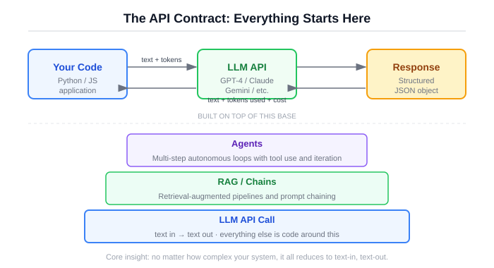
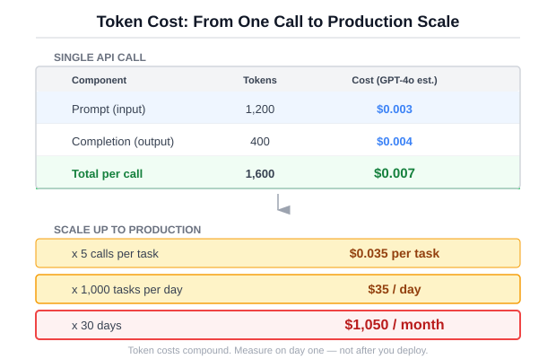
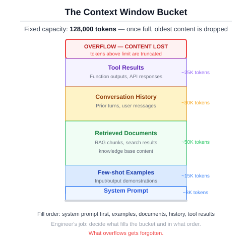
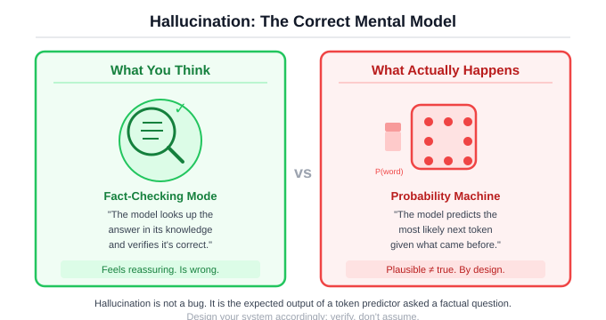

# Section 0a: How LLMs Actually Work

You don't need to understand attention heads to build with LLMs. You need to understand five things. Here they are.

This is not a book about how LLMs are built internally. There are excellent resources for that (Raschka's *Build a Large Language Model (From Scratch)* is the best). This is about how to build production systems with LLMs as components. You don't need to understand transformers. You need to understand what breaks when you give a language model access to your tools.

## The API contract

Everything starts here. You send text, you get text back. That's it.

Every agent framework, every RAG pipeline, every chain-of-thought prompting technique, every multi-agent orchestration system is built on top of this one operation. Text in, text out. If you strip away every abstraction, this is what remains.

Here's a raw API call using the Anthropic SDK:

```python
import anthropic

client = anthropic.Anthropic()  # reads ANTHROPIC_API_KEY from env

message = client.messages.create(
    model="claude-sonnet-4-20250514",
    max_tokens=1024,
    messages=[
        {"role": "user", "content": "What is the capital of France?"}
    ]
)

print(message.content[0].text)
# "The capital of France is Paris."
```

!!! info "What just happened"
    You sent a string to an API. You got a string back. You paid for both strings, measured in tokens. That's the entire contract.

Now here's the same operation using the shared model client from this book's codebase:

```python
from src.shared.model_client import create_client
from src.shared.types import CompletionRequest, Message, Role

client = create_client(provider="anthropic", api_key="...", model_name="claude-sonnet-4-20250514")

request = CompletionRequest(
    messages=[
        Message(role=Role.SYSTEM, content="You are a helpful assistant."),
        Message(role=Role.USER, content="What is the capital of France?"),
    ],
    temperature=0.0,
)

response = await client.complete(request)
print(response.content)
# "The capital of France is Paris."
```

!!! info "What just happened"
    The model client wraps the raw API with typed inputs and outputs. Your agent code never imports `anthropic` or `openai` directly. You can swap providers, add cost tracking, or switch to a mock for testing, all without changing the code that calls it.

Why bother with the wrapper? Because when you build agents, you will call the model hundreds of times per day. You will want to track costs. You will want to swap between a fast cheap model and a slow expensive one depending on the task. You will want to run tests without hitting a real API. The wrapper makes all of that possible by centralizing the one operation that matters.

This is the foundation. If you understand this, you understand 80% of what frameworks are doing. The other 20% is prompt management, tool routing, and retry logic. All useful. None of it magic.

<figure>
  
  <figcaption>Figure 0a.1: The API contract. Text in, text out. Everything else is built on top.</figcaption>
</figure>

## Tokens, not words

LLMs don't process words. They process tokens, which are chunks of text that roughly correspond to word fragments. The word "understanding" might be two tokens ("understand" + "ing"). A space before a word is often part of the token. A number like "42" is one token. The string "1234567890" might be three tokens.

Why does this matter? Because everything about LLMs is priced and bounded in tokens. Context windows are measured in tokens. API costs are per-token. Rate limits count tokens. When someone says a model has a "128K context window," they mean 128,000 tokens, which is roughly 96,000 words, or about 300 pages of prose. That sounds like a lot. It's less than you think once you start filling it with system prompts, conversation history, retrieved documents, and tool results.

Here's a quick estimator:

```python
def count_tokens_estimate(text: str) -> int:
    """Rough token count: ~4 characters per token.

    Not exact (use tiktoken for precision), but good enough
    for cost projections and context budget planning.
    """
    return max(1, len(text) // 4)

# Try it
prompt = "Analyze this document and extract all mentions of financial risk."
tokens = count_tokens_estimate(prompt)
print(f"Estimated tokens: {tokens}")
# Estimated tokens: 15
```

!!! info "What just happened"
    The 4-characters-per-token rule is a rough approximation. It's wrong for individual strings, but accurate enough in aggregate for cost planning and context budgeting. Use `tiktoken` when you need precision.

Now the cost math. This is where engineers need to pay attention because costs sneak up on you:

```python
# Pricing per 1M tokens: (prompt_price, completion_price)
MODEL_PRICING = {
    "gpt-4o":                     (2.50, 10.00),
    "gpt-4o-mini":                (0.15,  0.60),
    "claude-sonnet-4-20250514":   (3.00, 15.00),
    "claude-haiku-4-5-20251001":  (0.80,  4.00),
}

def estimate_cost(prompt_tokens: int, completion_tokens: int, model: str) -> float:
    prompt_price, completion_price = MODEL_PRICING.get(model, (1.00, 5.00))
    return (prompt_tokens / 1_000_000) * prompt_price + \
           (completion_tokens / 1_000_000) * completion_price

# One call: cheap
cost_one = estimate_cost(prompt_tokens=1000, completion_tokens=500, model="claude-sonnet-4-20250514")
print(f"One call: ${cost_one:.4f}")
# One call: $0.0105

# 10,000 calls: not cheap
cost_day = cost_one * 10_000
print(f"10,000 calls: ${cost_day:.2f}")
# 10,000 calls: $105.00
```

!!! info "What just happened"
    A single API call costs fractions of a cent. But agents make multiple calls per request, and production systems handle thousands of requests per day. The arithmetic compounds fast. An agent that averages 5 model calls per request at $0.01 each, serving 10,000 requests a day, costs $500/day. Know this number before you ship.

Notice that completion tokens are 3-5x more expensive than prompt tokens across every provider. This is not arbitrary. Generating tokens requires sequential computation, while reading prompt tokens can be partially parallelized. The practical implication: an agent that generates long, verbose reasoning is more expensive than one that generates concise answers, even if they read the same context.

<figure>
  
  <figcaption>Figure 0a.2: Token costs per model. Completion tokens always cost more than prompt tokens.</figcaption>
</figure>

## The context window is your entire working memory

Think of the context window as RAM for the conversation. Everything the model knows about your current request has to fit inside it. The system prompt, the user's message, the full conversation history, any documents you retrieved, the results from tool calls, all of it competes for one fixed-size bucket.

This is the constraint that shapes every architectural decision in this book.

When you build a RAG system, you're deciding what to put in the context window. When you design a multi-turn agent, you're managing what stays in the context window across steps. When you pick a chunking strategy for documents, you're optimizing for what fits in the context window.

Here's what a typical context window looks like for an agent request:

```
┌─────────────────────────────────────────┐
│ System prompt              ~500 tokens  │
│ Tool definitions           ~800 tokens  │
│ Conversation history     ~2,000 tokens  │
│ Retrieved documents      ~6,000 tokens  │
│ Previous tool results    ~1,500 tokens  │
│ Current user message       ~200 tokens  │
│─────────────────────────────────────────│
│ TOTAL                   ~11,000 tokens  │
│ Remaining (128K model)  ~117,000 tokens │
│ Remaining (8K model)      OVERFLOW      │
└─────────────────────────────────────────┘
```

That 117,000 token remainder looks comfortable. But add a 50-page document (roughly 37,000 tokens) and three rounds of agent tool use (each round adds the tool call, the result, and the model's analysis), and you're burning through context fast.

The dangerous part: when context overflows, the model doesn't crash. It degrades silently. Quality drops. The model starts ignoring instructions, especially the ones at the beginning of the context (your system prompt). It misses relevant information buried in the middle. You won't get an error. You'll get a worse answer with no indication that anything went wrong.

"Lost in the middle" is a well-documented phenomenon. Models pay the most attention to the beginning and end of the context, and less attention to the middle. When you add a 50-page document to the context, something gets pushed out or ignored. Usually it's the instructions you put at the beginning.

This is why context management is engineering, not just prompt writing. The decisions about what goes into the context, in what order, and what gets dropped when space is tight, these are architectural decisions with direct impact on system quality.

<figure>
  
  <figcaption>Figure 0a.3: The context window. Everything competes for one fixed-size bucket. Overflow is silent.</figcaption>
</figure>

## Why it hallucinates (and why you can't prompt it away)

The model predicts the next likely token. That's all it does. It is not looking up facts. It is not checking a database. It is generating the token sequence that is most probable given everything that came before it. When that process produces text that sounds authoritative but is factually wrong, we call it hallucination. But from the model's perspective, nothing unusual happened. It produced a high-probability token sequence. It just happened to be wrong.

This is not a bug to fix. It is a fundamental property of how these models work. A model trained on text will produce text that looks like the text it was trained on. If the training data contains confident, well-structured explanations, the model will produce confident, well-structured explanations, whether or not they are correct.

You will read advice telling you to add "only answer based on the provided context" to your system prompt. This helps. It reduces the rate of hallucination. It does not solve the problem. The model can and will still generate plausible-sounding text that isn't supported by the context. I've seen models cite specific paragraph numbers from documents that don't have paragraph numbers. I've seen them invent API endpoints with correct-looking URL structures and reasonable-sounding parameter names. The text looks right because the model is very good at producing text that looks right.

Every reliable mitigation for hallucination is engineering, not prompting.

**Grounding:** Give the model source material and constrain it to answer from that material. This is what RAG does. It doesn't eliminate hallucination, but it gives the model something real to work from.

**Validation:** Check the output against known facts, schemas, or constraints. If the model says the answer is in paragraph 3 of document X, verify that paragraph 3 of document X exists and says what the model claims.

**Evaluation:** Measure hallucination rates systematically across a test set. Not "try a few examples and see if it looks right." Structured evaluation with labeled ground truth. Chapter 6 covers this in detail.

**Escalation:** When confidence is low, say so. "I don't have enough information to answer this" is a better response than a confident wrong answer. Build your system to produce this response when the evidence is thin.

These are code solutions, not prompt solutions. You cannot prompt your way to reliability. You can engineer your way there.

<figure>
  
  <figcaption>Figure 0a.4: The hallucination mental model. The model predicts likely tokens, not verified facts. Mitigation happens in code, not in prompts.</figcaption>
</figure>

## Temperature and sampling

When the model generates the next token, it doesn't pick one deterministically (by default). It produces a probability distribution over all possible tokens, then samples from that distribution. Temperature controls how peaked or flat that distribution is.

**Temperature 0** (or near-zero): The model almost always picks the highest-probability token. Output is deterministic, or very close to it. Same input produces the same output. This is what you want for agents making decisions.

**Temperature 0.7-1.0:** The distribution is flatter. Lower-probability tokens have a real chance of being selected. Output is more varied, more "creative." This is useful for brainstorming, creative writing, or generating diverse examples.

**Temperature above 1.0:** The distribution is nearly flat. The model picks tokens almost at random. Output becomes incoherent. Don't do this.

For agents, use temperature 0 or near-zero. You want predictable decisions, not creative ones. When your agent is deciding whether to call the search tool or the calculator, you want it to make the same decision every time for the same input.

```python
from src.shared.model_client import create_client
from src.shared.types import CompletionRequest, Message, Role

client = create_client(provider="anthropic", api_key="...", model_name="claude-sonnet-4-20250514")

# Temperature 0: deterministic, same answer every time
request_deterministic = CompletionRequest(
    messages=[
        Message(role=Role.SYSTEM, content="You are a helpful assistant."),
        Message(role=Role.USER, content="Name one benefit of unit testing."),
    ],
    temperature=0.0,
)

# Temperature 1.0: varied output, different answer each time
request_creative = CompletionRequest(
    messages=[
        Message(role=Role.SYSTEM, content="You are a helpful assistant."),
        Message(role=Role.USER, content="Name one benefit of unit testing."),
    ],
    temperature=1.0,
)

# Run the deterministic version 3 times: same answer
for _ in range(3):
    r = await client.complete(request_deterministic)
    print(r.content)
# "Unit testing catches regressions early..."
# "Unit testing catches regressions early..."
# "Unit testing catches regressions early..."

# Run the creative version 3 times: different answers
for _ in range(3):
    r = await client.complete(request_creative)
    print(r.content)
# "Unit testing catches regressions early..."
# "It provides a safety net when refactoring..."
# "Tests serve as living documentation..."
```

!!! info "What just happened"
    Temperature 0 gives you repeatability. Temperature 1.0 gives you variety. For agent systems where you need predictable, testable behavior, always default to temperature 0. Save higher temperatures for tasks where diversity is the goal.

There's a common misconception that temperature 0 means "more accurate." It doesn't. It means "most probable." The most probable completion can still be wrong. Temperature controls randomness, not correctness.

## Structured output

The model generates text. Your code needs data. This gap is where a lot of production systems break.

When you ask a model to "return JSON," you get text that usually looks like JSON. Usually. Sometimes the model wraps it in markdown code fences. Sometimes it adds a preamble ("Sure! Here's the JSON:"). Sometimes it produces valid JSON that doesn't match your schema. Sometimes it produces invalid JSON.

There are two approaches to reliable structured output. The first is provider-level enforcement, where the API guarantees the output matches a JSON schema. OpenAI's `response_format` parameter and Anthropic's tool use both support this. The second is parsing with fallbacks, which is what you use when provider enforcement isn't available or when you're working with models that don't support it.

Here's the parsing approach from this book's codebase:

```python
import json
import re

def parse_structured_output(text: str) -> dict | None:
    """Parse a JSON object from model output.

    Tries three strategies:
    1. The whole text is valid JSON.
    2. Extract the first {...} block.
    3. Give up and return None.
    """
    # Strategy 1: direct parse
    try:
        result = json.loads(text.strip())
        if isinstance(result, dict):
            return result
    except json.JSONDecodeError:
        pass

    # Strategy 2: regex extraction
    match = re.search(r"\{[^{}]*\}", text, re.DOTALL)
    if match:
        try:
            result = json.loads(match.group())
            if isinstance(result, dict):
                return result
        except json.JSONDecodeError:
            pass

    return None

# The model cooperates
clean = '{"status": "ok", "confidence": 0.95}'
print(parse_structured_output(clean))
# {"status": "ok", "confidence": 0.95}

# The model adds preamble
messy = 'Here is the analysis: {"result": "pass", "score": 87} Hope that helps!'
print(parse_structured_output(messy))
# {"result": "pass", "score": 87}

# The model ignores your instructions entirely
no_json = "I analyzed the document and found three key themes."
print(parse_structured_output(no_json))
# None
```

!!! info "What just happened"
    Models don't always follow formatting instructions. Robust systems handle this with layered parsing: try the clean path first, fall back to extraction, and handle failure explicitly. The `None` return is a feature. It means "the model didn't give us structured data, so we need to retry, escalate, or use a default."

This is the bridge between "text generator" and "system component." When the model returns structured data, you can write normal code around it. You can validate fields. You can route on values. You can feed the output into the next step of a pipeline. Without structured output, you're writing string-parsing code that breaks every time the model decides to rephrase its response.

I think the right default is to use provider-level schema enforcement whenever it's available, and fall back to parsing only when it's not. Provider enforcement is more reliable, costs nothing extra, and removes an entire category of bugs. The parsing fallback exists for the real world, where you don't always control which model you're calling.

## Putting it together

You now have a mental model of the machine you're building with. It takes text and returns text. It costs money per token, with completion tokens costing more than prompt tokens. It has a fixed-size working memory that degrades silently when overloaded. It confidently generates plausible text whether or not that text is true. Its randomness is tunable, and for agent work you want it pinned to zero. Getting structured data out of it requires either provider enforcement or defensive parsing.

Every engineering decision from here forward is about working within and around these constraints. Context management. Cost control. Hallucination mitigation. Structured interfaces between the model and the rest of your system. These are the problems this book solves.

For hands-on experiments with everything in this section, see the [LLM Explorer](../projects/llm-explorer.md) project.

Next, we give it the ability to do things.
