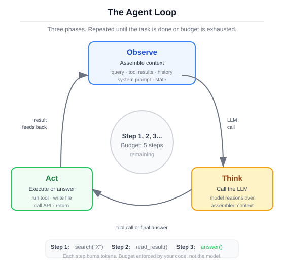
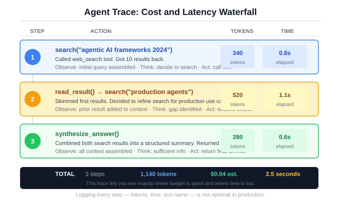
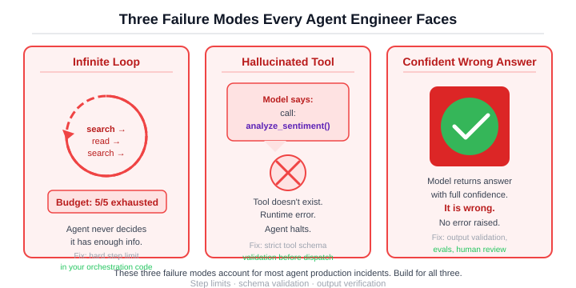
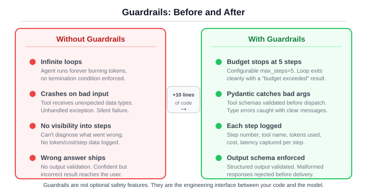

# Section 0c: Your First Agent, No Framework

You have a system that can call tools. But it calls them once and stops. What if it could look at the result, decide it's not enough, and try again? That's an agent. The entire concept is a while loop with an LLM inside it. Let's build one.

## The loop in 20 lines

Here is the skeleton of every agent ever built:

```python
while steps < budget:
    response = call_llm(messages)
    if response.has_tool_calls:
        result = execute_tool(response.tool_calls[0])
        messages.append(tool_call + result)
        steps += 1
    else:
        return response.content  # Model decided it's done
```

That's it. That is the core architecture. Every framework, every SDK, every "agent platform" I've looked at wraps some variation of this loop.

Read it line by line:

1. **`while steps < budget`** prevents infinite loops. Without a budget, a confused model will call tools forever. This is not theoretical. It will happen on your first real task.

2. **`call_llm(messages)`** sends the full conversation, including all previous tool calls and results, back to the model. The model sees everything that has happened so far and decides what to do next.

3. **`if response.has_tool_calls`** is the decision point. The model either wants to take an action (call a tool) or deliver a final answer (return text). There is no third option.

4. **`execute_tool()`** runs the function locally. The model never executes anything. It writes JSON requesting a function call. Your code does the work.

5. **`messages.append()`** feeds the tool result back into the conversation. This is how the model "observes" the outcome of its action. Next iteration, it sees the result and decides whether to act again or answer.

6. **`return response.content`** is how the loop ends cleanly. The model decided it has enough information and produced a text answer instead of another tool call.

The loop implements observe-think-act-repeat. This cycle has a name in the literature (ReAct, for Reason + Act), but the pattern predates the paper. It's a control loop with a language model in the middle.

<figure>
  
  <figcaption>Figure 0c.1: The agent loop. Observe, think, act, repeat. The model decides when to stop.</figcaption>
</figure>

## Building it step by step

The skeleton above is pseudocode. The real thing lives in `src/ch00/raw_agent.py`, about 100 lines. We'll walk through it in pieces.

### The system prompt

The system prompt is how you tell the model what kind of agent it should be. Here's the one from the companion code:

```python
SYSTEM_PROMPT = (
    "You are a research assistant with access to tools. "
    "Use the available tools to answer the user's question accurately. "
    "When you have enough information to answer fully, respond with plain text. "
    "Do not call tools unnecessarily -- stop as soon as you can give a good answer."
)
```

!!! info "What just happened"
    Four sentences. The first establishes the role. The second gives permission to use tools. The third defines the termination condition: respond with text when you have enough information. The fourth prevents over-calling. That last sentence matters more than it looks. Without it, models will call tools "just to be thorough" even when they already know the answer.

Notice what the prompt does not say. It doesn't describe how to use the tools (the schemas handle that). It doesn't list which tools exist (the registry provides that). It doesn't say how many steps to take (the budget handles that in code). The system prompt handles intent. Code handles constraints.

### The result type

Before the loop, we need a place to put what comes out of it:

```python
@dataclass
class AgentResult:
    """The outcome of a single agent run."""
    answer: str | None
    steps: int
    total_tokens: int
    total_cost_estimate: float
    elapsed_ms: float
    budget_exhausted: bool
    trace: list[dict] = field(default_factory=list)
```

!!! info "What just happened"
    `AgentResult` captures everything you need to evaluate a run. `answer` is `None` when the budget ran out before the model produced a final answer. `trace` records every tool call and its result, which you'll use for debugging. `budget_exhausted` is the field that tells you something went wrong. In a production system, this dataclass would be the contract between the agent and whatever consumes its output.

The `trace` field records every tool call, every argument, every result. When something goes wrong (and it will), the trace is how you figure out what the model was thinking.

### The agent class

Here is the `Agent` itself, with the core loop:

```python
class Agent:
    def __init__(
        self,
        client: ModelClient,
        registry: ToolRegistry,
        max_steps: int = 5,
        system_prompt: str = SYSTEM_PROMPT,
    ) -> None:
        self.client = client
        self.registry = registry
        self.max_steps = max_steps
        self.system_prompt = system_prompt
```

Four dependencies. The `client` talks to the model. The `registry` holds the tools. `max_steps` is the budget. `system_prompt` is overridable. No inheritance, no plugin system, just constructor arguments.

Now the `run` method:

```python
async def run(self, user_query: str) -> AgentResult:
    messages: list[Message] = [
        Message(role=Role.SYSTEM, content=self.system_prompt),
        Message(role=Role.USER, content=user_query),
    ]
    tool_schemas = self.registry.get_schemas()
    trace: list[dict] = []
    total_tokens = 0
    steps = 0

    for step in range(self.max_steps):
        steps = step + 1
        request = CompletionRequest(messages=messages, tools=tool_schemas)
        response = await self.client.complete(request)

        if response.usage:
            total_tokens += response.usage.total_tokens

        # Model wants to call a tool.
        if response.tool_calls:
            tc = response.tool_calls[0]
            tool_result = execute_tool_call(
                self.registry, tc.name, tc.arguments
            )

            trace.append({
                "type": "tool_call",
                "step": steps,
                "tool": tc.name,
                "arguments": tc.arguments,
                "result": tool_result,
            })

            messages.append(
                Message(
                    role=Role.ASSISTANT,
                    content=f"[tool_call: {tc.name}({tc.arguments})]",
                )
            )
            messages.append(
                Message(
                    role=Role.TOOL,
                    content=tool_result,
                    name=tc.name,
                    tool_call_id=tc.id,
                )
            )
            continue

        # Model returned a text answer.
        if response.content:
            trace.append({
                "type": "response",
                "step": steps,
                "content": response.content,
            })
            return AgentResult(
                answer=response.content,
                steps=steps,
                total_tokens=total_tokens,
                total_cost_estimate=0.0,
                elapsed_ms=elapsed_ms,
                budget_exhausted=False,
                trace=trace,
            )

    # Budget exhausted.
    return AgentResult(
        answer=None,
        steps=steps,
        total_tokens=total_tokens,
        total_cost_estimate=0.0,
        elapsed_ms=elapsed_ms,
        budget_exhausted=True,
        trace=trace,
    )
```

Walk through the key decisions:

**`for step in range(self.max_steps)`** is a hard ceiling. The loop runs at most `max_steps` times. Default is 5. This is the simplest possible guardrail, and I would not ship an agent without it. Remove it and a single confused query can burn through your entire API budget.

**`CompletionRequest(messages=messages, tools=tool_schemas)`** sends the full conversation plus all tool schemas every iteration. The model sees everything: the system prompt, the original question, every tool call it made, every result it got. This growing message list is the agent's working memory.

**`if response.tool_calls`** is where the model's decision becomes your code's branch. Tool call? Execute, record, append, `continue`. Text answer? Record and return. Two branches, nothing else.

**`messages.append()`** happens twice per tool call: once for the assistant's tool request, once for the tool's result. Both go into the conversation so the model sees what it asked for and what it got back.

**The final `return` after the loop** handles budget exhaustion. `answer` is `None`. `budget_exhausted` is `True`. The caller knows the agent gave up.

## Run it on a real task

Give the agent a question that requires two tool calls: "What is 15 * 7 + 3?"

The agent can't do this in one step. It needs to multiply first, then add. Here's what the trace looks like:

```
Query: What is 15 * 7 + 3?

[Step 1] tool_call  calculator({"operation": "multiply", "a": 15, "b": 7})
         result:    "105.0"

[Step 2] tool_call  calculator({"operation": "add", "a": 105, "b": 3})
         result:    "108.0"

[Step 3] response   "15 * 7 + 3 = 108.0"

Answer:  "15 * 7 + 3 = 108.0"
Steps:   3
Tokens:  195
Budget exhausted: False
```

Three steps, three model calls, three decisions. The agent multiplied first, used that result to set up the addition, then synthesized the final answer. Each step, the model saw everything that came before and chose what to do next.

<figure>
  
  <figcaption>Figure 0c.2: A multi-step agent trace. Each row is a model call. The model sees accumulated context and decides whether to call a tool or answer.</figcaption>
</figure>

!!! info "What just happened"
    The model could have done this math in its head. Most models can multiply 15 by 7 without a calculator. But we told it to use tools, and we gave it a calculator, so it did. This is actually correct behavior: following instructions over taking shortcuts. In production, the tools will do things the model genuinely cannot do, like query a database or call an API. The pattern is the same regardless.

Notice how cheap this was. Three model calls, 195 tokens, about $0.001. The cost becomes meaningful at scale (10,000 queries a day) or when the agent takes many more steps per query. Both happen in production.

## Watch it fail

The demo works. Now break it. These failures are not edge cases. They are the default behaviors of an unsupervised agent.

### Failure 1: The infinite loop

Give the agent a vague, open-ended task: "Search for everything ever written about artificial intelligence."

```
Query: Search for everything ever written about AI.

[Step 1] tool_call  search({"query": "AI history"})
         result:    [{"title": "Result 1 for 'AI history'", ...}]

[Step 2] tool_call  search({"query": "AI future predictions"})
         result:    [{"title": "Result 1 for 'AI future predictions'", ...}]

[Step 3] tool_call  search({"query": "AI ethics and safety"})
         result:    [{"title": "Result 1 for 'AI ethics and safety'", ...}]

Answer:  None
Steps:   3
Budget exhausted: True
```

The model never stopped searching. It kept finding new facets, kept deciding there was more to look up, and ran out of budget before synthesizing an answer. With a budget of 3, you wasted three API calls. With a budget of 50, you'd waste fifty.

!!! warning "Why this happens"
    The model has no internal sense of "enough." It doesn't know when diminishing returns kick in. If the task is unbounded ("everything about X"), the model will keep exploring until something forces it to stop. The budget is that force. But the budget is a blunt instrument. It stops the loop. It doesn't teach the model to converge. Better system prompts, explicit instructions about when to stop searching, are part of the fix. Chapter 6 covers this in depth.

!!! warning "Failure case study: the $2 query that should have cost $0.05"
    A product comparison agent had `max_steps=10` because the developer wanted to "give it room to think." A user asked "What's the cheapest flight from London to Paris next Tuesday?" The agent searched for flights, then searched for airline reviews, then searched for airport transfer options, then searched for hotel deals near the airport, then searched for travel insurance, then searched for visa requirements, then searched for currency exchange rates. Seven search calls, each feeding back context that grew the token count per call. Total cost: $1.87 for a query that needed one search and one answer. The fix: start with `max_steps=3`. If the agent exhausts its budget, examine the trace. Most of the time, the task was answerable in fewer steps and the model was being "thorough" rather than efficient. Raise the budget only after you have evidence that more steps produce materially better answers for your workload.

### Failure 2: The hallucinated tool call

The model invents a tool that doesn't exist. This happens when the model's training data includes functions that your registry doesn't have.

```
Query: What is the weather in London?

[Step 1] tool_call  weather({"city": "London"})
         result:    "Error: unknown tool 'weather'"

[Step 2] response   "I'm sorry, I don't have access to a weather
                     tool. I can't check the current weather."

Answer:  "I'm sorry, I don't have access to a weather tool."
Steps:   2
Budget exhausted: False
```

The model decided it needed a weather API and called `weather` with reasonable-looking arguments. The function doesn't exist. `execute_tool_call` returned a structured error instead of crashing, the model read that error, and gracefully explained the limitation.

!!! info "What just happened"
    This is the validation layer from Section 0b doing its job. `execute_tool_call` checks whether the tool exists before trying to run it. When it doesn't exist, it returns a string error that gets sent back to the model as a tool result. The model reads "Error: unknown tool 'weather'" and self-corrects. If `execute_tool_call` had thrown an exception instead of returning an error string, the agent loop would have crashed and the user would have gotten nothing.

This happens frequently with general-purpose models. The model "knows" tools exist for weather, email, calendar, and dozens of other domains. It will try to call them. Your registry is the gatekeeper.

### Failure 3: The confident wrong answer

This is the hardest failure to catch. The model stops early with a wrong answer, and it sounds completely confident.

```
Query: What is the population of the largest city in Australia?

[Step 1] response   "The largest city in Australia is Sydney,
                     with a population of approximately 5.3 million."

Answer:  "The largest city in Australia is Sydney, with a
          population of approximately 5.3 million."
Steps:   1
Budget exhausted: False
```

The model didn't even use the search tool. It answered from its training data without checking. The answer might be roughly right. It might be outdated. It might be wrong. The point is that the model made a judgment call ("I already know this") and skipped verification.

Nothing in the trace looks wrong. One step, an answer, no budget exhaustion. Every metric says success. But the answer could be stale, imprecise, or fabricated.

!!! warning "Why this is the dangerous one"
    The infinite loop is visible. The hallucinated tool call produces an error. But the confident wrong answer looks exactly like a correct answer. The only way to catch it is to build evaluation into your system: compare the agent's output against ground truth. Prompting alone does not solve this. You need test suites. Chapter 6 builds them.

!!! warning "Failure case study: one search was not enough"
    A fact-checking agent was asked "Is Company X still publicly traded?" It searched once, found a 2023 article mentioning the company's IPO, and answered "Yes, Company X is publicly traded." It did not search for more recent news. The company had been taken private six months earlier. The agent stopped after one search because it had "enough information to answer fully," exactly as the system prompt instructed. The fix was not to remove that instruction (you need it to prevent runaway loops). The fix was to add a verification nudge to the system prompt: "For factual claims about current status, search for the most recent information available, not just the first result." A more robust fix, covered in Chapter 6, is to build minimum-step checks: if the task type requires recency, require at least two searches with different date-scoped queries before answering.

<figure>
  
  <figcaption>Figure 0c.3: Three failure modes. The first two are loud. The third is silent. Silent failures are the ones that reach production.</figcaption>
</figure>

These are not edge cases. These are the default behaviors of an agent without engineering discipline. Every one of these failures is what the rest of the book teaches you to prevent.

## Add basic guardrails

Ten lines of code turn a fragile demo into something that fails gracefully. Not production-ready, but no longer embarrassing.

### Guardrail 1: The iteration budget

You already have this. The `max_steps` parameter caps the loop:

```python
agent = Agent(client=client, registry=registry, max_steps=5)
```

Five is a reasonable default for simple tasks. For complex research tasks that chain many tool calls, you might go to 10 or 15. Going above 20 is usually a sign that the task is too vague or the tools are too narrow. If the agent needs 20 steps, reconsider the task decomposition before raising the budget.

### Guardrail 2: Input validation

Use Pydantic to validate the user's query before it enters the loop. This is what you built in Section 0b, applied to the agent's input:

```python
from pydantic import BaseModel, Field

class AgentQuery(BaseModel):
    query: str = Field(min_length=1, max_length=2000)
    max_steps: int = Field(default=5, ge=1, le=20)

# Validate before running
validated = AgentQuery(query=user_input, max_steps=requested_steps)
result = await agent.run(validated.query)
```

!!! info "What just happened"
    Pydantic rejects empty queries, absurdly long queries, and step budgets outside your acceptable range before the agent spends a single token. This costs nothing and prevents a class of issues that are annoying to debug after the fact.

### Guardrail 3: Step logging

Print what happens at each step. This is the minimum viable observability:

```python
for step in range(self.max_steps):
    steps = step + 1
    response = await self.client.complete(request)

    tokens_this_step = response.usage.total_tokens if response.usage else 0
    total_tokens += tokens_this_step
    print(f"[Step {steps}] tokens={tokens_this_step} total={total_tokens}")

    if response.tool_calls:
        tc = response.tool_calls[0]
        print(f"  -> tool_call: {tc.name}({tc.arguments})")
        tool_result = execute_tool_call(self.registry, tc.name, tc.arguments)
        print(f"  <- result: {tool_result[:100]}")
        # ... append to messages and continue
```

In production, replace `print` with structured logging. But `print` is infinitely better than nothing. When the agent does something unexpected at 2am, these logs are the difference between a five-minute diagnosis and a blind debugging session.

<figure>
  
  <figcaption>Figure 0c.4: Before and after guardrails. Ten lines of code. Budget caps the loop. Validation rejects bad input. Logging shows you what happened.</figcaption>
</figure>

This is 10% of what production hardening looks like. Chapter 6 gives you the other 90%: evaluation suites, cost tracking, retry policies, circuit breakers, and structured observability. But these three guardrails are the ones you add on day one.

## The code in full

Here is the complete agent in one block. You can read this top to bottom in ten minutes and understand everything that happens. No hidden utilities. No imports from libraries that do the hard work for you. The three imports at the top are the pieces you built in previous sections: `ModelClient` (the provider-neutral wrapper from Section 0a), `ToolRegistry` and `execute_tool_call` (the tool registration and dispatch from Section 0b). In the companion code, these live in `src/shared/` and `src/ch00/`. In a real project, they would be your own modules.

```python
"""A minimal agent: a while loop with an LLM inside it."""

from __future__ import annotations

import time
from dataclasses import dataclass, field

from src.shared.model_client import ModelClient
from src.shared.types import CompletionRequest, Message, Role
from src.ch00.tool_use import ToolRegistry, execute_tool_call


SYSTEM_PROMPT = (
    "You are a research assistant with access to tools. "
    "Use the available tools to answer the user's question accurately. "
    "When you have enough information to answer fully, respond with plain text. "
    "Do not call tools unnecessarily -- stop as soon as you can give a good answer."
)


@dataclass
class AgentResult:
    """The outcome of a single agent run."""
    answer: str | None
    steps: int
    total_tokens: int
    total_cost_estimate: float
    elapsed_ms: float
    budget_exhausted: bool
    trace: list[dict] = field(default_factory=list)


class Agent:
    """A minimal agent that loops between model calls and tool execution."""

    def __init__(
        self,
        client: ModelClient,
        registry: ToolRegistry,
        max_steps: int = 5,
        system_prompt: str = SYSTEM_PROMPT,
    ) -> None:
        self.client = client
        self.registry = registry
        self.max_steps = max_steps
        self.system_prompt = system_prompt

    async def run(self, user_query: str) -> AgentResult:
        start_time = time.monotonic()

        messages: list[Message] = [
            Message(role=Role.SYSTEM, content=self.system_prompt),
            Message(role=Role.USER, content=user_query),
        ]
        tool_schemas = self.registry.get_schemas()
        trace: list[dict] = []
        total_tokens = 0
        steps = 0

        for step in range(self.max_steps):
            steps = step + 1
            request = CompletionRequest(messages=messages, tools=tool_schemas)
            response = await self.client.complete(request)

            if response.usage:
                total_tokens += response.usage.total_tokens

            # Model wants to call a tool.
            if response.tool_calls:
                tc = response.tool_calls[0]
                tool_result = execute_tool_call(
                    self.registry, tc.name, tc.arguments
                )

                trace.append({
                    "type": "tool_call",
                    "step": steps,
                    "tool": tc.name,
                    "arguments": tc.arguments,
                    "result": tool_result,
                })

                messages.append(
                    Message(
                        role=Role.ASSISTANT,
                        content=f"[tool_call: {tc.name}({tc.arguments})]",
                    )
                )
                messages.append(
                    Message(
                        role=Role.TOOL,
                        content=tool_result,
                        name=tc.name,
                        tool_call_id=tc.id,
                    )
                )
                continue

            # Model returned a text answer.
            if response.content:
                elapsed_ms = (time.monotonic() - start_time) * 1000
                trace.append({
                    "type": "response",
                    "step": steps,
                    "content": response.content,
                })
                return AgentResult(
                    answer=response.content,
                    steps=steps,
                    total_tokens=total_tokens,
                    total_cost_estimate=0.0,
                    elapsed_ms=elapsed_ms,
                    budget_exhausted=False,
                    trace=trace,
                )

        # Budget exhausted.
        elapsed_ms = (time.monotonic() - start_time) * 1000
        return AgentResult(
            answer=None,
            steps=steps,
            total_tokens=total_tokens,
            total_cost_estimate=0.0,
            elapsed_ms=elapsed_ms,
            budget_exhausted=True,
            trace=trace,
        )
```

One file. One class. One loop. No decorators, no metaclasses, no dependency injection. Every line is visible. Every decision is explicit.

This is the agent you will compare against every framework you evaluate. You wrote the tool registry, the schema generation, the validation layer, the agent loop, the trace, and the guardrails. In Section 0d, you will rebuild this same agent using Google ADK and LangChain. The tool logic stays the same. The system prompt stays the same. The failure modes stay the same. What changes is that four things get automated: tool registration (the `ToolRegistry` and `to_schema()` you wrote), the agent loop (the `for` loop above), conversation state (the growing `messages` list), and tracing (the `trace` dictionary). The hard engineering decisions do not disappear. They just move inside the framework. When someone shows you a 500-line agent class with plugins, middleware, and lifecycle hooks, you will now know exactly what those 500 lines are wrapping: the 100-line version you just wrote.

## What you built, and what comes next

You just built an agent. It works. It also breaks in predictable ways. You added basic guardrails that help, but you made a dozen judgment calls by instinct: how big the budget, when to stop searching, what to do when confidence is low, whether this task even needed an agent or could have been a simple tool call. Those instincts were sometimes right. But instincts do not scale to a team of five engineers building agent systems. Chapter 1 gives you the precise vocabulary to make these decisions explicit. It defines five system types, from single LLM calls through multi-agent orchestrations, and gives you a decision framework for choosing when a task needs the loop you just built and when a deterministic workflow is the better call. The rest of the book gives you the engineering to build whichever one you choose, for production.

For an expanded version with more tools, proper error handling, and example queries, see the [Research Agent](../projects/research-agent.md) project.
