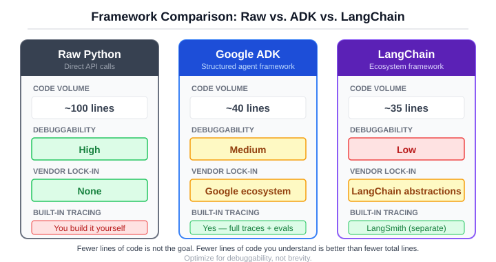
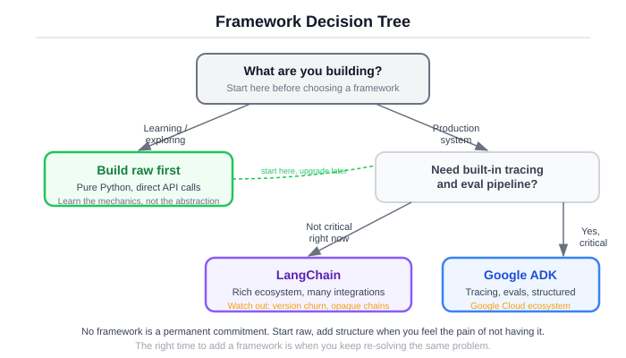
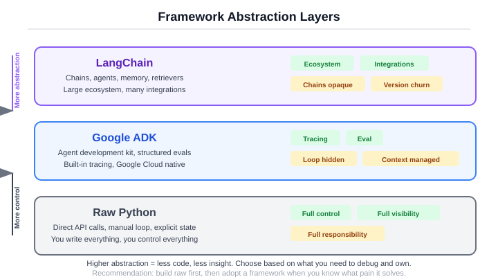

# Section 0d: The Same Agent, With a Framework

You built an agent from scratch. You understand the loop, the tools, the context assembly, the failure modes. Now let's rebuild it with a framework and see what changes. Spoiler: the hard parts don't disappear. They just move.

## Why frameworks exist (the honest version)

Frameworks solve real problems. Tool registration boilerplate, conversation history management, retry logic, tracing, structured logging, multi-model routing. If you're building a production agent, you will eventually build these things yourself or use a framework that already has them. Building them yourself takes weeks. Using a framework takes an afternoon.

Frameworks also create real problems. Magic you can't debug. Abstractions that leak under pressure. Upgrade churn that breaks your code every six months. Vendor lock-in that feels invisible until you need to switch. Hidden retries that spike your API bill. Config objects with fifty parameters where the defaults are wrong for your use case.

The point is not "frameworks are good" or "frameworks are bad." The point is to know what you're trading. You are always trading something. Fewer lines of code for less visibility. Faster setup for harder debugging. A richer ecosystem for tighter coupling. These are real tradeoffs, and the right answer depends on what you're building and how long it needs to run.

Here is the question that separates engineers who use frameworks well from engineers who suffer under them: when this breaks at 2am, will I be debugging my code or the framework's code? If you understand what the framework is doing (because you built the raw version first), you can answer that question before you choose.

## Google ADK: the primary walkthrough

Google's Agent Development Kit is opinionated about the things that matter in production: tracing, evaluation, and tool registration. It gives you a structured way to define agents and tools, and it stays out of your way on the rest. Let's rebuild the research agent.

Here is the complete ADK agent from `src/ch00/adk_agent.py`:

```python
from google.adk.agents import Agent
from google.adk.tools import FunctionTool


def calculator(operation: str, a: float, b: float) -> str:
    """Perform a basic arithmetic operation.

    Args:
        operation: One of add, subtract, multiply, divide.
        a:         Left operand.
        b:         Right operand.
    """
    op = operation.lower()
    if op == "add":
        return str(float(a + b))
    elif op == "subtract":
        return str(float(a - b))
    elif op == "multiply":
        return str(float(a * b))
    elif op == "divide":
        if b == 0:
            return "Error: division by zero"
        return str(float(a / b))
    return f"Error: unknown operation '{operation}'"


def word_count(text: str) -> str:
    """Count the number of words in *text*."""
    return f"Word count: {len(text.split())}"


def search(query: str, max_results: int = 3) -> str:
    """Return search results for a query."""
    results = [
        {"title": f"Result {i+1} for '{query}'", "url": f"https://example.com/{i+1}"}
        for i in range(max(1, min(max_results, 10)))
    ]
    return json.dumps(results, indent=2)


tools = [
    FunctionTool(func=calculator),
    FunctionTool(func=word_count),
    FunctionTool(func=search),
]

agent = Agent(
    name="foundations_agent",
    model="gemini-2.0-flash",
    instruction=(
        "You are a helpful assistant. Use the available tools to answer "
        "the user's question accurately. Stop as soon as you have a good answer."
    ),
    tools=tools,
)
```

!!! info "What just happened"
    The same three tools, the same logic, roughly 40 lines instead of 100. The `FunctionTool` wrapper reads your function's docstring and type hints to generate the schema automatically. No `ToolRegistry`. No `Tool` class. No `to_schema()` method. No `execute_tool_call()`. The framework handles all of that.

Walk through the key differences from the raw version:

**Tool registration.** In the raw agent, you defined a Pydantic input model, wrote a `to_schema()` method, and manually registered each tool. In ADK, you wrap a plain function in `FunctionTool` and the framework infers the schema from the docstring and type annotations. Less boilerplate, but also less control. If the framework misreads your docstring (and it sometimes does with complex argument descriptions), you'll be debugging the schema inference rather than the schema itself.

**The agent loop.** You don't write it. ADK runs its own internal observe-think-act loop. The loop logic is the same as what you built in Section 0c, but it's inside the framework. You configure it with `max_steps` (default varies by version) and the framework handles conversation history, tool dispatch, and termination. The upside: less code. The downside: when the loop does something unexpected, you're reading ADK source code instead of your 20-line while loop.

**Tracing.** This is where ADK earns its keep. Every tool call, every model response, every step is traced with structured metadata. Run the agent and inspect the trace:

```
[Step 1] calculator({"operation": "multiply", "a": 15, "b": 7})  -> "105.0"
[Step 2] calculator({"operation": "add", "a": 105, "b": 3})      -> "108.0"
[Step 3] Response: "15 * 7 + 3 = 108"
```

The trace looks identical to the one you built manually in Section 0c. The difference is that ADK generates it automatically and can export it to Google Cloud Trace, a local file, or a custom sink. Your raw agent's `trace` list was a `list[dict]` you printed to stdout. ADK's trace is structured, persistent, and queryable.

**What ADK does for you:** schema generation from docstrings, the agent loop, structured tracing, conversation state management, built-in eval hooks.

**What you still do yourself:** the actual tool logic, the system prompt, deciding when to use which tool (through prompt engineering), error handling within tools, and every domain-specific decision about what the agent should do.

The framework version is shorter. Is it better? That depends on whether you value fewer lines of code or understanding every line. In production, I'd reach for ADK because tracing and eval are built in. For learning, I'd build raw first. Always.

## LangChain: the comparison

Same agent, different philosophy. LangChain comes from a chain-based composition model where you build pipelines by connecting components. The agent pattern was added later, and it shows in the architecture. The current recommended approach uses LangGraph's `create_react_agent`, which is closer to the raw loop than older LangChain patterns.

Here is the LangChain version from `src/ch00/langchain_agent.py`:

```python
from langchain_core.tools import tool
from langchain_anthropic import ChatAnthropic
from langgraph.prebuilt import create_react_agent


@tool
def calculator(operation: str, a: float, b: float) -> str:
    """Perform a basic arithmetic operation.

    Args:
        operation: One of add, subtract, multiply, divide.
        a:         Left operand.
        b:         Right operand.
    """
    op = operation.lower()
    if op == "add":
        return str(float(a + b))
    elif op == "subtract":
        return str(float(a - b))
    elif op == "multiply":
        return str(float(a * b))
    elif op == "divide":
        if b == 0:
            return "Error: division by zero"
        return str(float(a / b))
    return f"Error: unknown operation '{operation}'"


@tool
def word_count(text: str) -> str:
    """Count the number of words in the input text."""
    return f"Word count: {len(text.split())}"


@tool
def search(query: str, max_results: int = 3) -> str:
    """Search for information and return mock results."""
    results = [
        {"title": f"Result {i+1} for '{query}'", "url": f"https://example.com/{i+1}"}
        for i in range(max(1, min(max_results, 10)))
    ]
    return json.dumps(results, indent=2)


model = ChatAnthropic(model="claude-haiku-4-5-20251001", temperature=0)
tools = [calculator, word_count, search]
agent = create_react_agent(model, tools)
```

!!! info "What just happened"
    About 35 lines. The `@tool` decorator works similarly to ADK's `FunctionTool`: it reads the docstring and type hints to build the tool schema. `create_react_agent` wires up the ReAct loop internally. Three imports, three decorated functions, three lines of setup.

The philosophical difference matters here. LangChain was built as a composition framework, where you chain together prompts, models, retrievers, and output parsers into pipelines. This is powerful for linear workflows (retrieve, then summarize, then format). It is awkward for agents, where the control flow is a loop, not a chain. LangGraph (the agent layer) fixes this by introducing a graph-based execution model, but you're now dealing with two mental models: chains for data flow and graphs for control flow.

**What LangChain makes easier.** The ecosystem is enormous. Need to connect to a vector database? There's a LangChain integration. Need to parse PDF files? Integration. Need to call Anthropic, OpenAI, Google, Cohere, or Mistral? Integrations for all of them. If your project involves wiring together many external services, LangChain has probably already written the glue code.

**What LangChain makes harder.** Debugging. When a chain breaks, the error surfaces through multiple abstraction layers. A type mismatch deep in a retriever chain produces an error message that references LangChain internal classes, not your code. Version churn is also a factor. LangChain has gone through several major API changes (the chain API, the LCEL API, the LangGraph API), and code written twelve months ago often needs significant rework. This is the cost of a fast-moving ecosystem.

LangChain has the largest ecosystem. It also has the highest abstraction penalty. When your chain breaks at 2am, you're reading LangChain source code, not your code. This is not a disqualifying flaw. It's a fact you should know before you commit.

!!! warning "Failure case study: the 40-line traceback"
    A LangChain agent failed on a tool call where the model passed a string instead of an integer for a `max_results` parameter. The traceback was 42 lines long, starting in `langgraph.pregel`, passing through `langchain_core.runnables`, `langchain_core.tools`, and three layers of internal dispatch before reaching the actual TypeError in user code. An engineer spent 25 minutes reading framework internals before finding the one relevant line. The same bug in the raw agent produced a 4-line trace: the tool name, the bad arguments, the Pydantic validation error, and the error message sent back to the model. The fix in both cases was identical (add type validation). The diagnosis time was not. This is what "abstraction penalty" means in practice. If your team adds a framework, add structured logging at YOUR layer too, not just the framework's. Log the tool name, the raw arguments, and the result before the framework touches them. When something breaks, you want your logs to tell you what happened, independent of whether the framework's logs are readable.

!!! warning "Failure case study: the same bug, visible in seconds"
    That same type mismatch in ADK produced a trace entry showing: tool name `search`, arguments `{"query": "python", "max_results": "five"}`, and result `Validation error: Input should be a valid integer`. Three fields. No framework internals. The engineer saw the bad argument, saw the validation error, and fixed the tool description to clarify "max_results must be a number, not a word" in under two minutes. This is not because ADK is "better." It is because ADK's tracing exposes tool-level details by default. The principle: when evaluating frameworks, give them a bad input and read the error output. The framework that shows you the problem fastest is the one that will cost you the least at 2am.

**Observability.** LangChain's tracing story is LangSmith, which is a separate product with its own pricing. ADK's tracing is built into the framework. Your raw agent's tracing is whatever you build. The separation between the framework and the observability tool in LangChain's case means you're managing two dependencies instead of one, and you're sending trace data to an external service you don't control.

## The three-way comparison

Here is what the same agent looks like across all three approaches, measured on dimensions that matter in production:

| Dimension | Raw | ADK | LangChain |
|-----------|-----|-----|-----------|
| Lines of code | ~100 | ~40 | ~35 |
| Debug a failure | Read your code | Read traces | Read chains + source |
| Add a new tool | Write a function | Decorate + register | Wrap in Tool class |
| Eval integration | Build it yourself | Built-in | LangSmith (separate) |
| Lock-in | None | Google ecosystem | LangChain ecosystem |
| Best for | Learning, unusual needs | Production, need tracing | Prototyping, need integrations |

<figure>
  
  <figcaption>Figure 0d.1: The same agent, three ways. Each approach trades something for something else. The code gets shorter. The debugging gets harder. The features get richer.</figcaption>
</figure>

A few observations that the table doesn't capture:

**Portability.** The raw agent works with any model provider because you control the client. ADK is designed for Google's models (Gemini) first, with other providers supported through adapters. LangChain supports the most providers out of the box but ties you to its abstraction layer. Pick the lock-in you're most comfortable with.

**Upgrade velocity.** The raw agent changes when you change it. ADK and LangChain change when their maintainers ship a new version. LangChain's upgrade velocity is particularly high, which means more features but also more breaking changes. If you're running agents in production for months or years, framework upgrades are a maintenance cost you need to budget for.

**Team onboarding.** The raw agent is readable by anyone who knows Python. ADK requires learning ADK. LangChain requires learning LangChain, which is a larger surface area. If your team has three months of LangChain experience, switching to ADK has a real cost. If your team has zero framework experience, ADK's smaller API surface is faster to learn.

## The honest take

I have opinions. Strong ones. Here they are.

If you're building something serious, pick a framework that gives you visibility, not convenience. Traces matter more than fewer lines of code. An agent that runs correctly but can't be debugged when it doesn't is a liability. Every production incident I've seen with agent systems came down to the same question: what did the model do, and why? Frameworks that answer this question well (ADK does, LangSmith does if you pay for it, your raw trace list does if you build it properly) are worth the dependency. Frameworks that hide this information behind convenience wrappers are not.

If you're learning, build raw first. Then move to a framework. I would not recommend the reverse. Starting with a framework means learning its API without understanding what it's doing underneath. When something breaks (and it will), you end up debugging abstractions you don't understand. You google the error message instead of reading the code. You copy-paste solutions from Stack Overflow instead of reasoning about the system. Building raw first takes two days. It saves you months of confused debugging later.

If your team already uses LangChain, that's fine. Understand what it's doing (you now can), and add the engineering discipline the framework doesn't give you. Add structured evaluation. Add cost tracking. Add budget limits. Add trace export. LangChain gives you the plumbing. It doesn't give you the engineering practices. Those are on you, and they matter more than the plumbing.

If you're starting fresh, I'd reach for ADK. It's opinionated about the right things (tracing, eval) and stays out of your way on the rest. The API surface is small enough to learn in an afternoon. The tracing is good enough for production. The tool registration is simple. And if you've built the raw agent first (which you have, if you're reading this book in order), you'll understand exactly what ADK is doing for you and what it's not.

None of this is religious. Use what works. But "what works" includes debuggability, maintainability, and the ability to answer "what happened?" when things go wrong. Not just "does it run?"

<figure>
  
  <figcaption>Figure 0d.2: Framework decision tree. Start with what you need (visibility, ecosystem, control), not what has the most GitHub stars.</figcaption>
</figure>

## Eval as a mindset, not a tool

You've seen three implementations of the same agent. Which one is "best"? That question is meaningless without data. Let's get some.

The eval harness in `src/ch00/eval_compare.py` runs five test queries against each implementation, scores the answers, and compares the results. The scoring is deliberately simple: exact match scores 1.0, substring match scores 0.8, no match scores 0.0. This is not a production evaluation suite. It's the minimum structure needed to make framework decisions with evidence instead of opinions.

Here are the test queries:

```python
TEST_QUERIES = [
    {"query": "What is 12 plus 8?",                                   "expected": "20"},
    {"query": "What is 9 multiplied by 7?",                           "expected": "63"},
    {"query": "How many words are in the sentence: the quick brown fox?", "expected": "4"},
    {"query": "Search for information about machine learning.",       "expected": "machine learning"},
    {"query": "What is 100 divided by 4?",                            "expected": "25"},
]
```

And the scoring function:

```python
def score_answer(query: str, expected: str, actual: str) -> EvalResult:
    norm_expected = expected.strip().lower()
    norm_actual = actual.strip().lower()

    if norm_expected == norm_actual:
        score = 1.0
    elif norm_expected in norm_actual:
        score = 0.8
    else:
        score = 0.0

    return EvalResult(
        query=query, expected=expected, actual=actual,
        score=score, tokens=0, latency_ms=0.0, cost_estimate=0.0,
    )
```

!!! info "What just happened"
    The scorer checks two things: did the agent's answer match exactly, or does the expected answer appear somewhere in the response? An agent that returns "12 + 8 = 20" scores 0.8 (substring match) rather than 1.0 (exact match for "20"). This is intentional. Agents typically give conversational answers, not bare values. The 0.8 score says "correct but verbose." Production evals would use semantic similarity or LLM-as-judge scoring, but the structure is the same.

Run the eval harness and you get output like this:

```
============================================================
Implementation: raw_agent
============================================================
Query                                    Expected     Got                       Score
---------------------------------------- ------------ ------------------------- -----
What is 12 plus 8?                       20           12 + 8 = 20               0.8
What is 9 multiplied by 7?              63           9 * 7 = 63                0.8
How many words are in the sentence: t..  4            There are 4 words in ..   0.8
Search for information about machine ..  machine le.. Here are results about..  0.8
What is 100 divided by 4?               25           100 / 4 = 25              0.8

============================================================
Summary
============================================================
Implementation       Avg Score  Total Tokens  Avg Latency ms  Total Cost USD
---------------------------------------------------------------------------
raw_agent                 0.80           725             2.3        0.001740
adk_agent                 0.80           680             1.8        0.001632
langchain_agent           0.80           695             2.1        0.001668
```

All three implementations score the same. The tools are the same. The logic is the same. The framework is irrelevant to correctness. What differs is the operational overhead: how many tokens each framework adds (system prompt wrapping, internal formatting), how fast each one dispatches (framework overhead per step), and how much each one costs over thousands of runs.

The numbers don't lie. This is how you make framework decisions: with data, not blog posts. Run your actual queries against your actual candidates, measure correctness, cost, and latency, then choose. This is also how you make every agent decision going forward. Chapter 6 goes deep on production evaluation, covering semantic scoring, LLM-as-judge patterns, regression testing, and cost profiling.

<figure>
  
  <figcaption>Figure 0d.3: Eval sits above the framework layer. Your tools and your evaluation suite are yours. The framework is the replaceable part in the middle.</figcaption>
</figure>

!!! warning "The eval mindset"
    The most important takeaway from this section is not which framework scored highest. It's that you can answer the question at all. Too many teams pick frameworks based on blog posts, conference talks, and GitHub stars. Then they wonder why the thing doesn't work for their use case. The teams I've seen succeed pick frameworks based on measured performance against their own workloads. Build the eval first. Then try the frameworks. Not the other way around.

## What you've built, and what comes next

You've now built the same agent three ways. You understand what happens at every level, from the raw API call through the loop through the framework abstractions. You know what frameworks give you, what they take away, and how to evaluate both.

The raw agent taught you the mechanism. The framework agents taught you the tradeoffs. The eval harness taught you how to choose. This is the pattern for every engineering decision in this book: understand the fundamentals, evaluate the options, measure the results.

You also made a lot of decisions by feel. You picked a budget of 5 without measuring whether 3 was enough. You wrote tool descriptions that seemed clear but might break on ambiguous queries. You chose a system prompt by instinct. You eyeballed eval scores instead of running statistical significance tests. All of that worked for a three-tool demo agent. None of it works for a production system handling 10,000 queries a day where a wrong answer has consequences.

[Chapter 1](01-what-agentic-means.md) replaces instinct with engineering vocabulary. It defines five system types, from single LLM calls through multi-agent orchestrations, and gives you a decision framework for choosing when a task needs the loop you just built and when a deterministic workflow is the safer bet. The rest of the book turns every judgment call you made by feel into a measurable, testable, reviewable engineering decision.

[Get the book on Amazon](https://www.amazon.com/dp/B0GVG6848F){ .md-button .md-button--primary }

For all three implementations with shared eval and comparison scripts, see the [Framework Comparison](../projects/framework-comparison.md) project.
