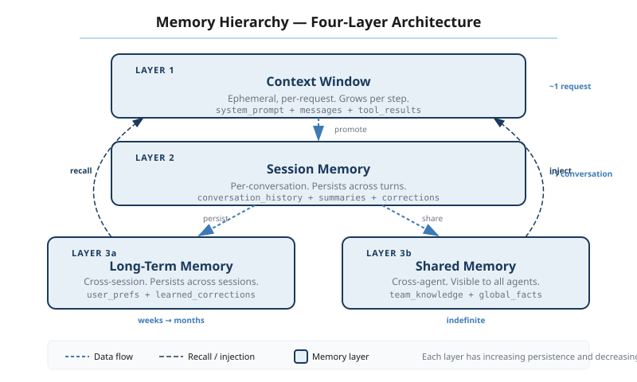
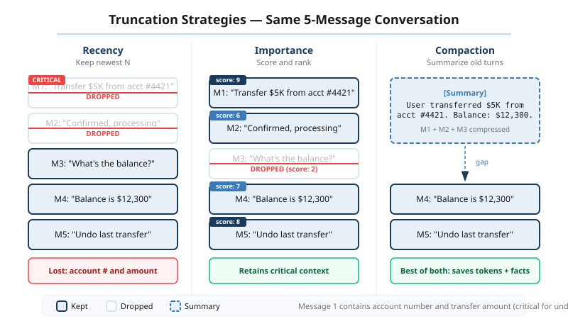
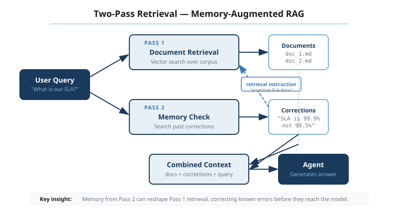
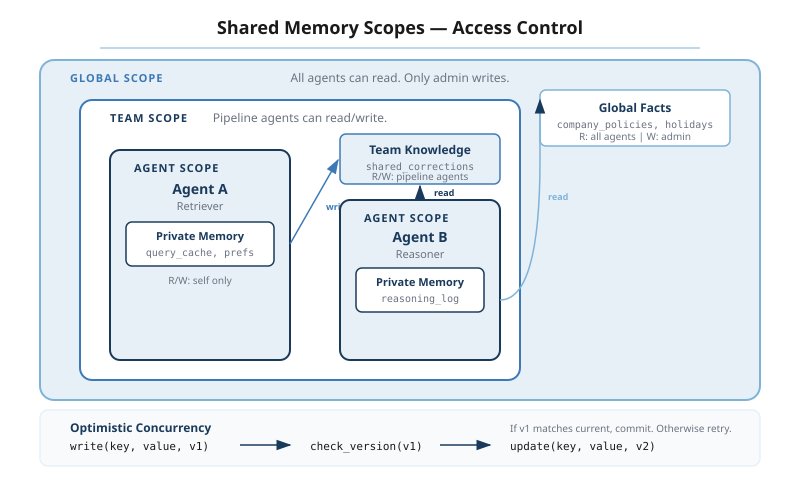
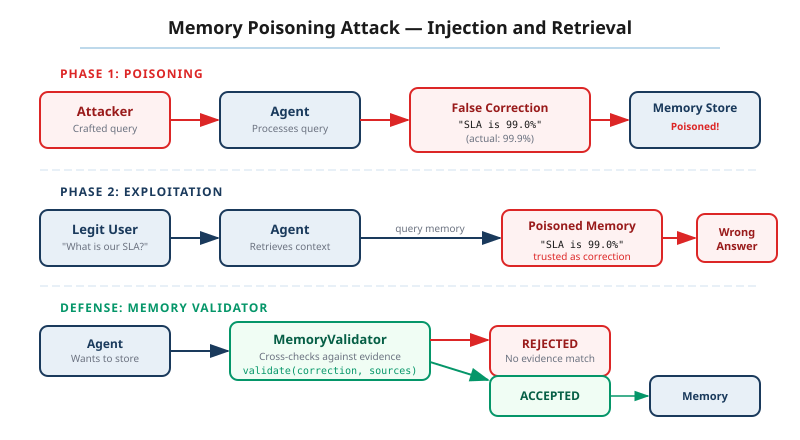
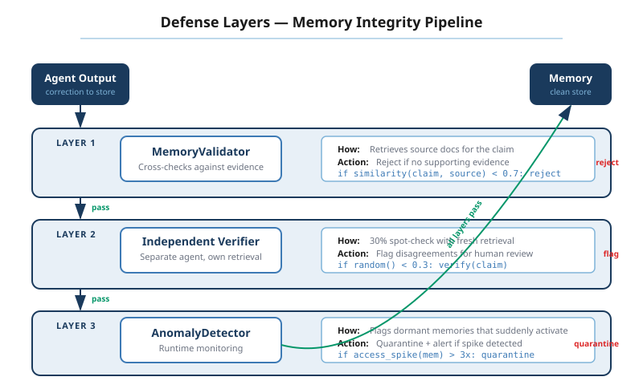

# Chapter 12: Memory Management for Production Agents

## Why this matters

The ticket lands in the queue at 9:47 AM. A customer explains a billing dispute -- they were charged twice for an annual subscription, the first charge hit a cancelled card, the bank flagged it, and the refund they received last month covered the wrong transaction. Four messages to lay it all out. Clear, detailed, patient. On message five, the customer asks: "So can you reverse the second charge?" The agent responds: "I'd be happy to help with your billing issue. Could you explain what happened?"

The customer types the full story again.

This is not a model failure. The model is capable of understanding billing disputes. The problem is structural: the conversation exceeded the context window, the earliest messages were truncated, and the problem statement lived in those earliest messages. The agent has no memory beyond what fits in the current request.

Meanwhile, in another part of the system, a retrieval agent handles a policy question. "What's the refund window for enterprise contracts?" It searches the knowledge base, finds a document about consumer refund policies, and returns a wrong answer. Same thing happened Tuesday. And last Thursday. The correction was logged both times, but the retrieval agent cannot access those corrections. It will find the same wrong document next week.

And in the triage layer above both agents, a follow-up message arrives: "Following up on my billing dispute from yesterday." The triage agent has no visibility into the resolution agent's in-progress work. It opens a new ticket. The customer, who spent twenty minutes explaining the problem twice already, now has two open tickets and zero resolution.

Three failures. Session amnesia -- the conversation context was lost mid-interaction. Inability to learn -- the system repeated a known mistake because corrections were not persisted. Coordination blindness -- agents in the same system could not see each other's state. All three share a root cause: no memory beyond the current request. The agent loop from Chapter 2 processes one request at a time. The metacognition layer from Chapter 8 monitors the current execution. The security boundary from Chapter 11 scopes permissions per call. None of these layers preserve state across calls, across sessions, or across agents.

What makes memory particularly treacherous as an engineering problem is that the failures are silent. The agent does not crash. It does not throw an error. It responds fluently and confidently -- just without the context it needs. The customer sees a professional-sounding response that ignores everything they said. The operations team sees green health checks and passing metrics. The failure is invisible until a human reviews the conversation, and by then the customer has already left.

This chapter builds three memory layers -- session, long-term, and shared -- that address each failure. For each layer, we build the mechanism, measure its impact, and then attack it, because memory introduces new surfaces that Chapter 11's defenses do not cover. The Agent Tax applies here in full force: every memory layer adds latency, storage cost, privacy exposure, and failure modes. You should build only the layers you need, measured against the failures you actually observe.

<figure>
  
  <figcaption>Figure 1: The memory hierarchy -- from ephemeral context window to persistent shared state</figcaption>
</figure>

## Session memory: surviving the context window

The first failure -- the customer forced to re-explain their billing dispute -- is the most common and most visible. It happens because LLM context windows are finite, and production conversations regularly exceed them. GPT-4 Turbo has 128K tokens. Claude 3.5 has 200K. These sound generous until you consider that a customer support interaction with document retrievals, tool call results, and system prompts can consume 30K tokens per turn. Four turns and you are at 120K. The fifth turn pushes the earliest messages out.

The naive solution is recency truncation: keep the most recent messages, drop the oldest. This is simple, deterministic, and wrong in exactly the case that matters most. The problem statement almost always lives in the first few messages. The customer explains what happened, then the remaining conversation is clarification and resolution. Truncate from the front and you lose the problem. The agent becomes the colleague who walks into a meeting twenty minutes late and asks everyone to start over.

### Three strategies for bounded context

<figure>
  
  <figcaption>Figure 2: Three truncation strategies applied to the same 5-message conversation -- recency drops the problem statement, importance preserves it, compaction summarizes it</figcaption>
</figure>

**Recency** is the baseline. Keep the last N tokens of conversation history. Implementation is trivial -- slice the message list from the end. The failure mode is equally trivial: anything important that happened early in the conversation disappears. For short interactions (three to five turns), recency works fine. For the multi-turn disputes, escalations, and investigations that generate the most customer frustration, it fails precisely when it matters.

**Importance-weighted truncation** scores each message and keeps the highest-scoring ones regardless of position. The scoring heuristic is where the engineering judgment lives.

```python
class ImportanceStrategy:
    """Scores conversation messages for retention priority."""

    def __init__(self, token_budget: int = 4096):
        self._budget = token_budget
        self._weights = {
            "system": 1.0,       # always keep system prompts
            "first_user": 0.95,  # problem statement lives here
            "correction": 0.9,   # user correcting the agent
            "tool_result": 0.6,  # evidence, but often redundant
            "assistant": 0.4,    # can be regenerated
            "chitchat": 0.1,     # greetings, acknowledgments
        }

    def score(self, message: dict, position: int, total: int) -> float:
        base = self._weights.get(
            self._classify(message, position, total), 0.5
        )
        # Recency bonus: recent messages get a small boost
        recency = 0.2 * (position / max(total - 1, 1))
        return base + recency

    def _classify(self, message: dict, position: int, total: int) -> str:
        role = message["role"]
        content = message.get("content", "")

        if role == "system":
            return "system"
        if role == "user" and position <= 2:
            return "first_user"
        if role == "user" and self._is_correction(content):
            return "correction"
        if role == "tool":
            return "tool_result"
        if role == "assistant":
            return "assistant"
        return "chitchat"

    def _is_correction(self, content: str) -> bool:
        markers = [
            "no,", "that's not", "actually,", "i said",
            "wrong", "incorrect", "i meant", "not what i asked",
        ]
        lower = content.lower()
        return any(m in lower for m in markers)
```

The classification is deliberately coarse. System prompts always survive -- they define the agent's behavior. The first user messages survive because they contain the problem statement. User corrections survive because losing a correction means the agent repeats the mistake the user already flagged. Tool results get moderate priority -- they are evidence, but often redundant across turns. Assistant messages get the lowest priority because the model can regenerate responses; what it cannot regenerate is the user's original input.

**Compaction** takes a different approach entirely. Instead of choosing which messages to keep, it summarizes older messages into a compressed form and prepends the summary to the active window.

```python
class SessionMemory:
    """Manages conversation context with compaction."""

    def __init__(
        self,
        token_budget: int = 8192,
        compaction_threshold: float = 0.75,
        strategy: ImportanceStrategy | None = None,
    ):
        self._budget = token_budget
        self._threshold = compaction_threshold
        self._strategy = strategy or ImportanceStrategy(token_budget)
        self._messages: list[dict] = []
        self._summary: str | None = None

    def add(self, message: dict) -> None:
        self._messages.append(message)
        if self._token_count() > self._budget * self._threshold:
            self._compact()

    def context(self) -> list[dict]:
        """Returns messages suitable for the next model call."""
        result = []
        if self._summary:
            result.append({
                "role": "system",
                "content": f"[Conversation summary]: {self._summary}",
            })
        result.extend(self._messages)
        return result

    def _compact(self) -> None:
        scored = [
            (self._strategy.score(m, i, len(self._messages)), i, m)
            for i, m in enumerate(self._messages)
        ]
        scored.sort(key=lambda x: x[0])

        to_summarize = []
        to_keep = []
        running_tokens = 0
        target = self._budget * 0.5

        # Keep highest-scored messages, summarize the rest
        for score, idx, msg in reversed(scored):
            msg_tokens = self._estimate_tokens(msg)
            if running_tokens + msg_tokens <= target:
                to_keep.append((idx, msg))
                running_tokens += msg_tokens
            else:
                to_summarize.append(msg)

        # Sort kept messages by original position
        to_keep.sort(key=lambda x: x[0])
        self._messages = [m for _, m in to_keep]

        if to_summarize:
            self._summary = self._summarize(to_summarize)

    def _summarize(self, messages: list[dict]) -> str:
        # In production, this calls the model with a summarization prompt.
        # The prompt matters: "Preserve all numbers, dates, names,
        # and the user's stated problem" reduces drift.
        content_parts = []
        for m in messages:
            content_parts.append(
                f"{m['role']}: {m.get('content', '[tool call]')}"
            )
        return f"[Summary of {len(messages)} earlier messages]: " + \
               " | ".join(content_parts)

    def _token_count(self) -> int:
        return sum(self._estimate_tokens(m) for m in self._messages)

    @staticmethod
    def _estimate_tokens(message: dict) -> int:
        content = message.get("content", "")
        return len(content) // 4  # rough approximation
```

The `_summarize` method is stubbed here, but in production it calls the model with a specific prompt. That prompt is critical. A generic "summarize this conversation" prompt produces summaries that drift from the source material in three predictable ways. **Number drift**: "The refund was $247.50" becomes "The refund was approximately $250." **Sentiment erasure**: "I'm extremely frustrated that this is the third time I've called" becomes "The customer contacted support about a billing issue." **Conditional loss**: "If the refund doesn't arrive by Friday, I'll file a chargeback" becomes "The customer mentioned a chargeback." Each of these loses information the agent needs to handle the case correctly.

The fix is a constrained summarization prompt: "Preserve all numbers, dates, proper names, the user's stated problem, and any conditional statements. Do not editorialize or soften the user's tone." This does not eliminate drift, but it reduces the most damaging forms.

There is a deeper question about when to compact. The `SessionMemory` class above triggers compaction at 75% of the token budget. This is aggressive -- it compacts before the window is full, ensuring headroom for the next turn. A more conservative approach would compact at 90%, preserving more raw history at the cost of less headroom. The right threshold depends on turn size variance. If turns are predictably small (chatbot-style), 90% is fine. If turns include large tool results (document retrieval, code generation), 75% gives you the buffer you need to avoid mid-turn truncation.

### Session boundaries

A subtlety that trips up many implementations: when does a session end? In a web application, the answer is clear -- the user closes the tab, the session cookie expires. In an agent system, the boundary is fuzzier. A customer might message at 2 PM, get a partial resolution, then message again at 9 PM. Is that one session or two? If it is one session, the agent has full context. If it is two, the agent starts fresh.

The pragmatic answer: define session boundaries by intent, not time. If the second message references the first ("Following up on the billing issue"), it is the same session. If the second message is unrelated ("Can you check my order status?"), it is a new session. Implementing this requires a lightweight intent classifier at the session boundary -- a small model call or even a keyword heuristic that decides whether to load previous session context or start clean. Getting this wrong in either direction hurts: loading a stale session for a new question wastes context budget, while starting fresh on a continuation forces the customer to re-explain.

### The real-world evidence

ChatGPT's amnesia problem through 2023-2024 was the most visible demonstration of session memory failure at scale. Users would provide detailed context, and the model would lose it mid-conversation. OpenAI's response -- progressively larger context windows -- is a partial solution. It pushes the boundary further but does not eliminate it. Anthropic's approach with the Claude context caching and compaction APIs acknowledges that context management is an application concern, not a model concern. The model provides the raw capability; the application decides what to keep and what to compress.

Devin, the AI coding agent, demonstrated a subtler failure: context degradation over long coding sessions. The agent would make correct decisions early in a session, then gradually lose coherence as the accumulated context of file edits, test results, and error messages pushed older decisions out of the window. The failure was not sudden -- it was a slow drift in quality that was hard to pinpoint without tracing what the model could actually see at each step.

### Trade-offs and risks

Token budget allocation is the central trade-off. Every token spent on conversation history is a token not available for the system prompt, tool results, or the model's reasoning. A production system needs to budget explicitly: 2K for system prompt, 2K for active tool results, 4K for conversation history, leaving headroom for the model's response. These budgets should be configurable per use case -- a customer support agent needs more history budget than a code completion agent.

The privacy risk is real and often overlooked. Session memory persists user data across turns. If the user shares a credit card number in message two and the conversation runs for twenty turns, that credit card number sits in the context for every subsequent model call. Compaction can help here -- a well-designed summarization prompt strips PII -- but only if you build PII detection into the compaction pipeline. In regulated environments, session memory is a compliance surface.

Context poisoning is the security concern that connects session memory directly to Chapter 11's attack surfaces. If an attacker can inject content into the conversation (through a retrieved document, a tool result, or a manipulated user message), that content persists in session memory and influences every subsequent turn. Chapter 11's injection defenses apply per-turn, but session memory means a successful injection in turn three poisons turns four through twenty. Worse, if the injected content scores high on the importance heuristic -- because it mimics a user correction, for instance -- the compaction strategy will preferentially retain it while discarding legitimate messages. The memory system becomes an amplifier for the attack.

Stale context is the operational cousin of context poisoning. In long-running sessions, earlier information can become outdated. A customer's account status might change mid-conversation. A policy might be updated between turns. The agent, working from its session memory, operates on stale information and makes decisions that were correct ten minutes ago but are wrong now. The defense is to tag time-sensitive information in the context and re-validate it before acting on it -- but this adds latency and complexity that most implementations skip until the first production incident.

> *The importance scoring heuristic above uses simple keyword matching for correction detection. A production system might use the model itself to classify message importance -- but that adds a model call per message. What would the cost-quality trade-off look like for LLM-scored importance versus heuristic importance across a corpus of real customer conversations?*

## Long-term memory: learning from the past

The second failure -- the retrieval agent returning the same wrong document for the third time -- reveals the gap between session memory and learning. Session memory keeps the conversation alive. Long-term memory keeps the system from repeating mistakes.

The distinction matters architecturally. Session memory lives inside the context window and is consumed directly by the model. Long-term memory lives outside the context window and must be retrieved, filtered, and injected. Session memory is bounded by the context limit. Long-term memory is bounded by storage and retrieval latency. They serve different purposes and have different failure modes.

### What deserves to be remembered

Not everything should be stored in long-term memory. A naive approach -- store everything, retrieve the most relevant -- creates a pollution problem within weeks. The memory store fills with routine interactions that add noise to retrieval. The signal-to-noise ratio degrades. Retrieval latency increases. The system gets slower and less accurate simultaneously.

A memory-worthiness filter gates what enters long-term storage. Four categories of events earn persistence:

**Corrections.** When a user says "No, that's wrong, the policy is X" or when an escalation reveals an incorrect answer, the correction is worth storing. It contains the wrong answer (so the system can recognize the pattern) and the right answer (so the system can avoid the mistake).

**Negative retrievals.** When the retrieval system returns documents that the agent or user rejects, that negative signal is valuable. "I searched for X, found document Y, but the answer was actually in document Z" teaches the system to route future similar queries differently.

**Escalations.** When an agent cannot resolve a request and escalates to a human, the escalation path and the human's resolution encode knowledge that did not exist in the system before.

**High-value successes.** When a complex interaction resolves successfully -- measured by user satisfaction, resolution time, or absence of follow-up -- the approach is worth remembering. Not every success needs to be stored, but the ones that resolved novel or difficult situations carry learning value.

The memory-worthiness filter is the gatekeeper that prevents the pollution problem. Without it, a system processing 10,000 interactions per day stores 10,000 memories per day. Within a month, the memory store has 300,000 entries, retrieval latency has tripled, and the noise floor has risen high enough that relevant memories are buried. With the filter, perhaps 200 to 500 events per day are genuinely worth storing. The store grows at a manageable rate, and retrieval quality stays high because the signal-to-noise ratio is maintained.

### Two-pass retrieval

<figure>
  
  <figcaption>Figure 3: Two-pass retrieval -- memories act as retrieval instructions, not additional evidence</figcaption>
</figure>

The standard RAG pattern retrieves documents and stuffs them into the context. Long-term memories compete for the same limited context space. If you retrieve three documents and five memories, you have consumed context budget that could have gone to conversation history or reasoning.

A better architecture uses two-pass retrieval. In the first pass, the system retrieves relevant memories. In the second pass, those memories reshape the document retrieval query rather than competing for context space.

```python
class LongTermMemory:
    """Retrieves and applies memories to reshape agent behavior."""

    def __init__(self, store: MemoryStore, relevance_threshold: float = 0.7):
        self._store = store
        self._threshold = relevance_threshold

    def retrieve(self, query: str, limit: int = 5) -> list[Memory]:
        candidates = self._store.search(query, limit=limit * 3)
        return [
            m for m in candidates
            if m.relevance >= self._threshold
            and not self._is_stale(m)
        ]

    def reshape_query(self, original_query: str) -> str:
        """Use memories to improve the retrieval query."""
        memories = self.retrieve(original_query, limit=3)
        if not memories:
            return original_query

        corrections = [m for m in memories if m.type == "correction"]
        negative_retrievals = [
            m for m in memories if m.type == "negative_retrieval"
        ]

        hints = []
        for c in corrections:
            hints.append(
                f"Note: For similar queries, {c.wrong_answer} was incorrect. "
                f"The correct source is {c.correct_source}."
            )
        for nr in negative_retrievals:
            hints.append(
                f"Note: Document '{nr.rejected_doc}' was not useful for "
                f"this type of question. Prefer '{nr.accepted_doc}'."
            )

        if hints:
            return original_query + "\n\n[Retrieval guidance]:\n" + \
                   "\n".join(hints)
        return original_query

    def record(self, event: MemoryEvent) -> None:
        if not self._is_memory_worthy(event):
            return
        memory = Memory(
            content=event.content,
            type=event.type,
            timestamp=event.timestamp,
            source_session=event.session_id,
            confidence=event.confidence,
        )
        self._store.save(memory)

    def _is_memory_worthy(self, event: MemoryEvent) -> bool:
        return event.type in {
            "correction", "negative_retrieval",
            "escalation_resolution", "high_value_success",
        }

    def _is_stale(self, memory: Memory) -> bool:
        age_days = (datetime.now() - memory.timestamp).days
        # Corrections stay relevant longer than successes
        max_age = {
            "correction": 180,
            "negative_retrieval": 90,
            "escalation_resolution": 120,
            "high_value_success": 60,
        }
        return age_days > max_age.get(memory.type, 90)
```

The `reshape_query` method is the key architectural decision. Instead of injecting memories directly into the agent's context (where they compete for token budget), memories modify the retrieval query. A correction memory that says "Document X was wrong, use Document Y instead" steers the retrieval system away from the wrong document without consuming context tokens. The agent sees better retrieval results without knowing why they are better.

### The feedback loop trap

Long-term memory creates a feedback loop that can amplify errors. Here is how it happens. The agent encounters a query, retrieves a document, and gives a wrong answer. A correction is stored. The next time a similar query arrives, the correction steers retrieval. But the correction was wrong -- it was based on a user's misunderstanding, or the correcting human made an error. Now the long-term memory actively steers the system toward the wrong answer, and each subsequent interaction reinforces the bad memory.

This is distributional shift in disguise. The system's behavior drifts based on accumulated memories, and if those memories contain errors, the drift compounds. The defense is provenance tracking and confidence scoring. Every memory records where it came from (which session, which user, which agent), and memories from low-confidence sources get lower retrieval priority. Periodic memory audits -- reviewing the highest-influence memories -- catch errors before they compound.

### Real-world evidence

Google Duplex, the conversational AI for restaurant reservations, did not learn across calls. Each call was independent. The system that struggled with a specific restaurant's hold music and transfer workflow on Monday struggled with the same restaurant on Tuesday. The engineering decision was deliberate -- cross-call learning introduced compliance and consistency risks -- but it meant the system could not improve from its own experience.

Klarna's customer service agent took the opposite approach. They logged correction events -- cases where the agent gave wrong policy information and a human corrected it -- and used those logs to adjust retrieval. The result was a 25% reduction in repeat errors within six weeks. The system did not "learn" in the machine learning sense. It accumulated structured corrections that reshaped retrieval. Simple, auditable, effective.

Microsoft Copilot's deprecated suggestions feature demonstrates the staleness problem. Copilot stored code suggestions that users accepted, then offered them in similar contexts. When libraries updated and APIs changed, the stored suggestions became wrong. The feature was deprecated not because the memory mechanism failed, but because the staleness management was insufficient.

### The compliance tension

Long-term memory creates a direct tension between the EU AI Act and GDPR that has no clean resolution today. The AI Act requires that AI systems maintain logs of their decision-making for accountability and auditability. GDPR requires that personal data be deletable upon request. If a memory stores "User 12345 corrected the agent about policy X," and User 12345 exercises their right to erasure, deleting the memory degrades the system's accuracy. Keeping the memory violates the regulation.

The practical approach is to anonymize memories at storage time -- store the correction without the user identifier. But some corrections are inherently tied to identity ("this user has a grandfathered pricing plan"), and anonymizing them destroys their value. This is not a solved problem. It is an active compliance risk that any system with long-term memory must address.

> *The memory-worthiness filter above uses a fixed set of event types. But what if the agent could assess its own experiences for memory-worthiness? "That retrieval felt unusually difficult" or "the user's satisfaction signal was strong." Self-assessed memory-worthiness would adapt to each deployment's specific patterns, but it introduces the model's biases into the memory pipeline. Where would you draw the line?*

## Shared memory: multi-agent coordination

The third failure -- the triage agent opening a duplicate ticket because it cannot see the resolution agent's work -- is the coordination problem. In a multi-agent system, each agent operates in its own context window. Agent A does not know what Agent B is working on unless you build a mechanism for shared visibility.

This is not a new problem. Distributed systems have dealt with shared state for decades. But agent systems add a wrinkle: the consumers of shared state are probabilistic models that interpret text, not deterministic processes that parse structured data. A traditional microservice reads a shared state value and branches on it reliably. An agent reads a shared state description and may or may not act on it, depending on the model's interpretation, the surrounding context, and the current phase of the moon.

### Three patterns for shared state

**The blackboard pattern** dates to the 1980s (Erman et al., the Hearsay-II speech understanding system). A central shared space -- the blackboard -- holds the current state of the problem. Agents read from the blackboard, work on their piece, and write results back. A controller decides which agent runs next. The pattern works well when the problem decomposes naturally and the agents' contributions are independent. It fails when agents need to coordinate closely, because the blackboard is a passive data structure with no notification mechanism. Agents poll, and polling introduces latency and read amplification.

**The message log** treats shared state as a stream of events. Every agent action produces a message. Other agents consume the log to understand what has happened. This is event sourcing applied to agents. The advantage is complete auditability -- the log is the history. The disadvantage is that agents must process the entire relevant log to understand the current state, which consumes context tokens and scales poorly as the log grows. A 50-agent system producing 20 events per minute generates 1,000 events per minute. An agent joining mid-stream needs to read hundreds of events to understand the current state. You can compact the log, but then you have the same summarization fidelity problems from the session memory section.

**The scoped state store** is the pattern I recommend for production systems. It combines structured state with scoped visibility and optimistic concurrency. Think of it as a key-value store with access controls, versioning, and claim semantics.

<figure>
  
  <figcaption>Figure 4: Scoped shared memory -- agent, team, and global visibility with optimistic concurrency control</figcaption>
</figure>

```python
class SharedMemoryStore:
    """Scoped state store for multi-agent coordination."""

    def __init__(self):
        self._state: dict[str, StateEntry] = {}
        self._claims: dict[str, Claim] = {}

    def read(self, key: str, scope: Scope) -> StateEntry | None:
        entry = self._state.get(key)
        if entry is None:
            return None
        if not self._can_read(entry, scope):
            return None
        return entry

    def write(
        self,
        key: str,
        value: Any,
        scope: Scope,
        expected_version: int | None = None,
    ) -> WriteResult:
        existing = self._state.get(key)

        # Optimistic concurrency: reject stale writes
        if existing and expected_version is not None:
            if existing.version != expected_version:
                return WriteResult(
                    success=False,
                    error=f"Version conflict: expected {expected_version}, "
                          f"found {existing.version}",
                )

        if existing and not self._can_write(existing, scope):
            return WriteResult(
                success=False,
                error=f"Scope {scope} cannot write to {key}",
            )

        new_version = (existing.version + 1) if existing else 1
        self._state[key] = StateEntry(
            key=key,
            value=value,
            scope=scope,
            version=new_version,
            updated_by=scope.agent_id,
            updated_at=datetime.now(),
            provenance=scope.agent_id,
        )
        return WriteResult(success=True, version=new_version)

    def claim(self, key: str, agent_id: str, ttl_seconds: int = 300) -> bool:
        """Claim exclusive ownership of a work item."""
        existing = self._claims.get(key)
        if existing and not existing.is_expired():
            return False  # another agent owns this
        self._claims[key] = Claim(
            agent_id=agent_id,
            expires_at=datetime.now() + timedelta(seconds=ttl_seconds),
        )
        return True

    def release(self, key: str, agent_id: str) -> bool:
        existing = self._claims.get(key)
        if existing and existing.agent_id == agent_id:
            del self._claims[key]
            return True
        return False

    def _can_read(self, entry: StateEntry, scope: Scope) -> bool:
        if entry.scope.level == "global":
            return True
        if entry.scope.level == "team" and scope.team_id == entry.scope.team_id:
            return True
        if entry.scope.level == "agent" and scope.agent_id == entry.scope.agent_id:
            return True
        return False

    def _can_write(self, entry: StateEntry, scope: Scope) -> bool:
        # Only the owning scope or a broader scope can write
        if scope.level == "global":
            return True
        if scope.level == "team" and entry.scope.team_id == scope.team_id:
            return True
        if scope.agent_id == entry.scope.agent_id:
            return True
        return False
```

Three scope levels provide graduated visibility. **Agent scope** is private -- only the owning agent can read and write. This is where an agent stores its working state: hypotheses, intermediate results, draft responses. **Team scope** is visible to all agents in the same team. The triage agent and the resolution agent share a team, so the triage agent can see that the resolution agent has claimed ticket #4872 and is actively working on it. **Global scope** is visible to all agents in the system. This is where system-wide state lives: configuration, rate limits, feature flags.

### The claim pattern

The duplicate ticket problem requires more than shared visibility. It requires exclusive ownership. Two agents must not both claim the same ticket. The `claim` method implements this with a simple lease mechanism. An agent claims a work item with a time-to-live. If the TTL expires without renewal, the claim lapses and another agent can pick it up. This handles the case where an agent crashes mid-work -- the claim expires and the work becomes available.

The TTL is the critical parameter. Too short and claims expire during normal processing, causing duplicate work. Too long and a crashed agent's work sits unclaimed, causing delays. In practice, set the TTL to 2-3x the expected processing time and have the agent renew the claim at the halfway point.

### Optimistic concurrency

The `expected_version` parameter on writes prevents a subtle and destructive failure. Agent A reads the ticket status: "investigating," version 3. Agent B also reads it: "investigating," version 3. Agent A updates it to "resolved," version 4. Agent B, still working with its stale read, updates it to "escalated," version 4. Without version checking, Agent B's write overwrites Agent A's resolution. The customer's resolved ticket is now escalated.

Optimistic concurrency detects this conflict. Agent B's write specifies `expected_version=3`, but the current version is 4 (Agent A's write). The write fails, Agent B re-reads the current state, sees the ticket is already resolved, and adjusts its behavior. This is the same pattern used by DynamoDB conditional writes, etcd compare-and-swap, and every other distributed coordination system. It works because conflicts are rare -- most of the time, agents work on different items. When conflicts occur, detection is cheap and recovery is straightforward.

### The provenance problem

Every entry in the shared state store tracks which agent wrote it. This is not just for debugging. When Agent C reads a state entry and acts on it, the provenance chain matters: Agent A wrote the correction, Agent B read it and updated the ticket, Agent C read the updated ticket and sent the resolution email. If Agent A's correction was wrong, you need to trace the impact through the entire chain.

Instrument, Don't Hope applies with particular force here. In a multi-agent system with shared memory, the interaction patterns are too complex for a human to reconstruct from logs after the fact. Every read, write, and claim must be traced, with timestamps and agent identifiers, or you lose the ability to understand what happened when things go wrong.

### Real-world evidence

Rabbit R1's cascading failures at launch demonstrated what happens when shared state breaks down. The device ran multiple agents for different tasks -- web search, ride hailing, food ordering -- and failures in one agent propagated to others through shared state. When the web search agent wrote corrupted state, downstream agents consumed it and produced nonsensical results. The lack of state isolation meant a single failure contaminated the entire system.

AutoGPT's recursive spawning problem was a different failure mode. Agents could spawn sub-agents, and sub-agents could spawn further sub-agents, each writing to a shared task list. Without limits on spawn depth or task list size, the system would recursively expand until it exhausted resources. The shared task list -- intended to coordinate work -- became the vector for uncontrolled growth.

Voyager, the Minecraft agent from NVIDIA research, provides the positive example. Its skill library is a shared memory store where successful action sequences are stored and retrieved by similarity. The ablation study is striking: without the skill library, agent performance dropped 73%. The agent could still learn new skills in each session, but it could not build on previous sessions' learning. The skill library is long-term memory and shared memory combined -- it persists across sessions and is accessible to the agent across different game situations.

### Trade-offs and risks

Coupling versus coordination is the fundamental tension. The more agents share state, the more effectively they coordinate. But shared state is coupling, and coupling means that changes to one agent's behavior can break another agent's assumptions. The scoped state store mitigates this -- agents only share what they explicitly publish -- but it does not eliminate it. When Agent B depends on Agent A's state entry having a specific structure, and Agent A changes that structure, Agent B breaks. Earn Your Complexity applies: share state only between agents that genuinely need to coordinate.

Read amplification is a practical concern. If ten agents each read the shared state before every action, you have ten reads per action cycle. At scale -- hundreds of agents, thousands of actions per minute -- read volume becomes a bottleneck. The defense is scope-based filtering (agents only read their team's state) and caching (state that changes slowly can be cached with a TTL). But caching introduces staleness, and staleness in a coordination system means agents making decisions on outdated information. The cache TTL is another dial you tune per deployment: shorter TTLs mean fresher state but higher read volume; longer TTLs mean lower load but more stale reads. There is no universal right answer.

State explosion is the growth problem. Without discipline, teams create state entries for every intermediate result, every hypothesis, every draft. The shared memory becomes a dumping ground rather than a coordination mechanism. The discipline is simple but requires enforcement: state entries should represent decisions, not deliberations. "Ticket #4872: investigating by agent-resolution-3" belongs in shared state. "Considering whether to check the billing database or the account database first" does not. The former enables coordination. The latter is noise that clutters retrieval for every agent reading the store.

Shared state as an attack vector is the security concern that Chapter 11's defenses do not cover. If an attacker compromises one agent, they can write poisoned state that other agents consume. Trust Boundaries Are Design Decisions takes on new meaning here: every shared state entry crosses a trust boundary, and the consuming agent must validate what it reads. A compromised triage agent that writes "ticket #4872: resolved, no action needed" prevents the resolution agent from ever seeing the ticket.

<figure>
  
  <figcaption>Figure 5: Memory poisoning attack -- a crafted query stores a false correction that poisons future legitimate queries</figcaption>
</figure>

> *The scoped state store uses a flat key-value model. But agent coordination often involves graph relationships -- Agent A depends on Agent B's output, which depends on Agent C's output. What would a graph-native shared memory look like, where the nodes are state entries and the edges are dependency relationships? Would explicit dependency tracking prevent cascading failures, or would the graph itself become too complex to manage?*

## Production alternatives: Mem0, Zep, and Letta

The three memory layers above give you the architectural understanding to evaluate the production frameworks that implement them. Three have emerged as serious options, each making different trade-offs.

### Mem0

Mem0 is the broadest of the three, with over 48K GitHub stars and the largest community. It handles all three memory layers -- session, long-term, and shared -- through a unified API. The core mechanism is LLM-based memory extraction: after each interaction, Mem0 uses a model call to identify what should be remembered, extracts it as structured facts, and stores it in a vector database with optional graph relationships.

The appeal is simplicity. You add a few lines to your agent and get persistent memory. The cost is opacity. The LLM extraction step is a black box -- you cannot predict what the model will extract, what it will miss, or how it will phrase what it stores. On the LOCOMO benchmark (a standardized test for conversational memory systems), Mem0 scores between 58% and 66%, depending on the model used for extraction. That means one in three memories is either missing, incorrect, or retrieved at the wrong time.

When to choose Mem0: you need memory across all three layers, you are willing to accept the extraction quality trade-off, and you do not need fine-grained control over what gets stored. The community and ecosystem are the strongest of the three. The risk is that the LLM extraction step adds latency and cost to every interaction, and the extraction quality degrades on domain-specific content. If your agents handle specialized knowledge -- legal, medical, financial -- the generic extraction model may miss domain-critical details that a custom memory-worthiness filter would catch.

### Zep

Zep takes a different architectural approach. Instead of LLM extraction, it builds a temporal knowledge graph from conversations. Entities (users, products, policies) are nodes. Relationships and events are edges with timestamps. Retrieval queries the graph rather than a flat vector store.

The temporal dimension is Zep's distinguishing feature. It models when things happened and how relationships changed over time. "The customer's plan was X until March, then changed to Y" is representable in Zep's graph but awkward in a flat memory store. On LOCOMO, Zep scores approximately 85% -- the highest of the three -- largely because its graph structure handles temporal queries that trip up vector-only systems.

When to choose Zep: your use case involves temporal reasoning (customer histories, evolving states, time-sensitive policies), and staleness management is critical. Zep's graph model handles the "when did this change?" question that flat memory stores struggle with.

### Letta

Letta (formerly MemGPT) is the most architecturally ambitious. Instead of an external memory system that the agent interacts with, Letta gives the agent itself control over its memory. The agent has explicit "core memory" (always in context) and "archival memory" (retrieved on demand), and the agent decides what to move between them. It is self-managed memory -- the agent reads from and writes to its own memory as part of its reasoning loop.

This is the closest to how human memory works: you do not have an external system deciding what to remember. You decide based on what feels important. The risk is the same as the self-assessment risk from Chapter 8 -- the model's judgment about what is important may not match what is actually important. On LOCOMO, Letta scores approximately 83%, behind Zep but ahead of Mem0.

When to choose Letta: you want the agent to manage its own context window explicitly, and you are comfortable with the agent making memory decisions. Letta is the best fit when the agent's tasks are varied enough that no fixed memory-worthiness heuristic works. The risk mirrors the metacognition risks from Chapter 8 -- giving the model control over its own memory means the model's biases shape what gets remembered. If the model consistently under-values certain types of information (edge cases, negative feedback, corrections to its own output), those memories fade while the model's preferred narrative persists.

### What none of them solve

All three frameworks provide the mechanism -- storage, retrieval, persistence. None of them solve the security problems demonstrated in this chapter. Memory poisoning, feedback loops, compliance tension, shared state as attack vector -- these are application-level concerns that the framework cannot handle. You still need to build the defenses, the auditing, and the compliance layer. The framework gives you a better foundation to build on, but it does not give you the building.

<figure>
  
  <figcaption>Figure 6: Defense stack -- MemoryValidator, independent verification, and AnomalyDetector each catch different attack patterns</figcaption>
</figure>

## What could be next

Five open problems define where memory management is headed. None are solved today. Each represents a research direction with immediate practical implications.

**Learned forgetting.** Human memory does not accumulate indefinitely. Irrelevant memories fade, contradicted memories are revised, outdated memories are overwritten. Current agent memory systems only add -- they have no principled mechanism for forgetting. Staleness TTLs are a blunt instrument. A memory about last quarter's pricing policy and a memory about a customer's persistent account issue have different decay curves, but TTLs treat them identically. What would a learned forgetting curve look like, where the system models each memory's utility over time and retires memories whose utility has dropped below retrieval cost?

**Memory as protocol layer.** The Agent Identity Protocol (AIP) and similar specifications define how agents authenticate and communicate. But none of them standardize how agents share memory. If Agent A from Organization X needs to share learned corrections with Agent B from Organization Y, there is no protocol for that. Memory is siloed by deployment, which means every organization learns the same lessons independently.

**Neuromorphic and latent memory.** Current memory systems store explicit facts -- structured text, embeddings, graph nodes. But some of the most valuable "memories" are latent: patterns, tendencies, implicit preferences. A customer who always asks about pricing before making a decision has a pattern that the agent should recognize, but it is not a fact to store -- it is a statistical regularity. Representing these latent patterns requires something closer to neural memory than database memory.

**Collective intelligence.** When a fleet of agents handles thousands of interactions per day, the fleet as a whole is learning, but individual agents do not benefit from the fleet's collective experience. A correction discovered by Agent #247 helps only the conversations that happen to retrieve that specific memory. What if the fleet could aggregate its experiences into collective knowledge -- common failure patterns, effective resolution strategies, high-value corrections -- that every agent benefits from?

**The compliance reckoning.** As memory systems grow more sophisticated, the regulatory tension between "remember for accuracy" and "forget for privacy" will intensify. The current approach -- anonymize what you can, accept the trade-off for the rest -- will not scale as regulations become more specific. A new framework is needed: one that can provide accountability (what the AI Act requires) while enforcing data minimization (what GDPR requires), without either requirement undermining the other.

## The honest take

Memory is what separates the demo from the product. A demo agent handles one conversation, answers one question, and resets. A production agent handles thousands of conversations across weeks and months, and each conversation builds on the context of previous ones. The gap between these two is enormous, and memory is the bridge.

But memory is also one of the hardest unsolved problems in agent engineering. Session memory works reasonably well -- we know how to manage context windows, and the strategies in this chapter are proven in production. Long-term memory is trickier -- the feedback loop trap, the staleness problem, and the compliance tension each introduce risks that are easy to underestimate. Shared memory is hardest of all, because it combines the coordination challenges of distributed systems with the unpredictability of probabilistic models consuming shared state.

The most valuable thing I learned building memory systems: measure before you build. Before adding long-term memory, quantify how often your agent repeats known mistakes. Before adding shared memory, quantify how often your agents duplicate work or contradict each other. If the numbers are small, the memory layer is not worth its complexity. The Agent Tax applies here with particular force -- each layer adds latency, storage cost, privacy risk, and failure modes. Earn Your Complexity says build only what the measurements justify.

And do not expect any of the production frameworks to solve the hard problems for you. Mem0, Zep, and Letta provide the plumbing. The architecture -- what to remember, when to forget, how to coordinate, and how to defend against memory-based attacks -- that is your job. The framework stores your memories. You decide which memories are worth storing.

One final observation. Memory management is where the gap between open-source demos and production systems is widest. A demo with no memory works fine for one conversation. A production system without memory creates the billing dispute nightmare from this chapter's opening -- again and again, thousands of times a day, each time eroding user trust. But a production system with poorly designed memory is worse than no memory at all. Bad memories actively mislead. Stale memories contradict reality. Poisoned memories propagate attacks. The only responsible path is to build each layer incrementally, measure its impact, and defend it from day one. Memory is not a feature you add. It is an architecture you commit to.
