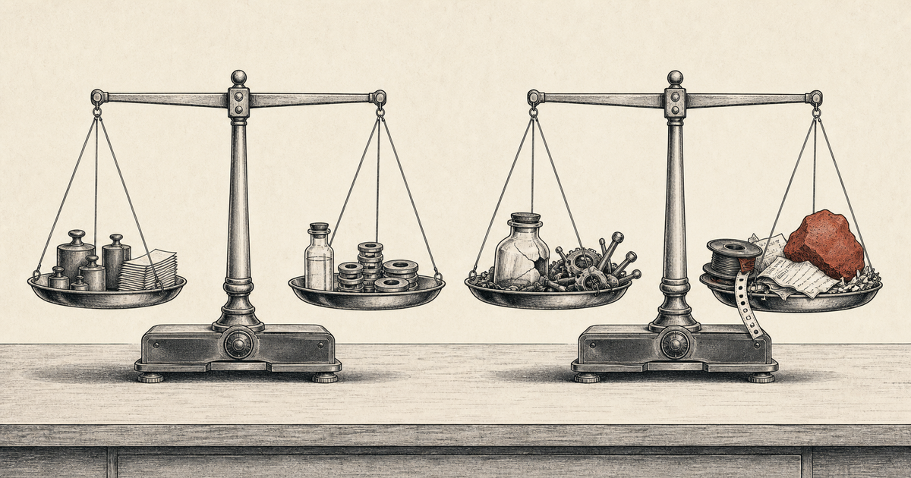
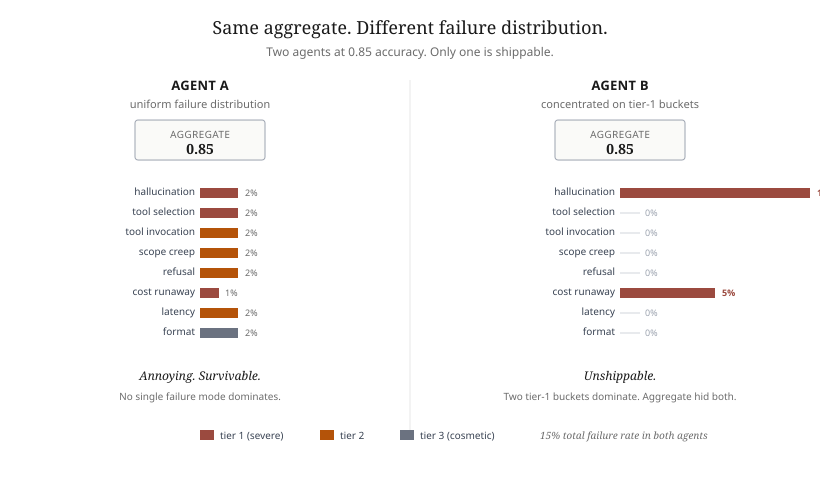

FN-0022026-05-177 min readChapter 6

# Your eval rubric needs failure buckets, not just scores

Two agents can score identically on a benchmark and fail differently in production. The aggregate is not a rubric. It is what falls out of one.

<figure markdown>
  { loading=lazy }
</figure>

The single largest reported pain point in agentic AI right now is not capability. It is evaluation. The LangChain State of AI Agents 2026 survey, with 1,340 practitioners responding, places evaluation at the top of the list. Stanford's HAI 2026 AI Index measures a 37 percent gap between lab benchmark scores and real-world deployment performance, with 50x cost variation across systems achieving comparable accuracy. Practitioners are calling 2026 the year benchmark trust collapsed. The reason is not that the benchmarks got worse. The benchmarks measure what they were designed to measure. The rubrics were never designed to catch the failure modes that get agents pulled from production.

A rubric that produces a single accuracy number tells you the average of your failure modes. It does not tell you which failure modes you have, or how much each one is costing you. For an agent that runs in production, that distinction is the entire game.

## The pattern

Failure buckets are the rubric. The aggregate score is downstream of it. Chapter 6 of the book frames a working eval harness around three architectural moves.

1. **Define the buckets before you write the eval.** Not after. A failure bucket is a category of mistake with three properties: a concrete example, a detection rule that does not require human review, and a severity tier. If you cannot write all three, the bucket is not ready for the rubric.
2. **Score by bucket distribution, not by aggregate accuracy.** A system at 0.85 accuracy with failures distributed evenly across eight buckets is a different system from one at 0.85 with all the failures concentrated in hallucination and cost runaway. The aggregate hides the difference. The distribution exposes it.
3. **Re-bucket on every model upgrade.** Buckets ossify. New models surface failure modes that did not exist on the prior model, and silence ones that did. If your bucket list has not changed in six months and you have changed models, the rubric is measuring a system you no longer run.

<figure markdown>
  { loading=lazy }
  <figcaption>Same aggregate. Different consequences. The agent on the right is unshippable, and the aggregate hides it.</figcaption>
</figure>

A working starting set of buckets, pulled from the book and refined across three deployments:

- **Hallucination.** Fabrication of facts, citations, or tool capabilities. Severity tier 1.
- **Tool selection error.** Wrong tool for the task. Tier 1 if the tool has side effects, tier 2 otherwise.
- **Tool invocation error.** Right tool, malformed arguments. Tier 2.
- **Scope creep.** Answering more than the task asked for. Tier 2.
- **Refusal.** Will not do something it should. Tier 2.
- **Cost runaway.** Right answer, infeasible spend. Tier 1.
- **Latency violation.** Right answer, too slow for the operating envelope. Tier 2.
- **Format violation.** Right answer, wrong shape. Tier 3.

Eight buckets is a starting point, not a target. A clinical agent needs an "unsafe recommendation" bucket. A code agent needs a "fabricated symbol" bucket. A retrieval agent needs a "stale citation" bucket. The general principle is the same. Name the failures. Write the detection rules. Score the distribution.

<figure markdown>
  { loading=lazy }
  <figcaption>The dial reads "average." Each room is failing in a different direction.</figcaption>
</figure>

## Where this fails

Failure buckets work cleanly for tasks with a bounded failure space. Open-ended generative work resists tidy bucketing because the failure modes are emergent. A research-synthesis agent can fail in ways the rubric designer did not anticipate. The honest answer is to ship the rubric anyway, mark a residual "other" bucket, and graduate failures out of "other" as patterns emerge. Buckets are a living artifact, not a one-time spec.

The pattern also fails when teams confuse precision for value. A rubric with thirty buckets and one example per bucket has lower signal than a rubric with eight buckets and twenty examples each. Bucket inflation looks rigorous and runs shallow. The discipline is fewer buckets, more examples.

The third failure mode is more political than technical. Failure buckets reveal which failure mode dominates. Sometimes the dominant bucket is the one a senior stakeholder shipped, or the one their roadmap depends on. The rubric will land harder than the aggregate score did. That is a feature, not a bug. It changes the conversation from "is the agent good enough" to "good enough at what."

## In code

The pattern is implemented in [`src/ch06/`](https://github.com/sunilp/agentic-ai/tree/main/src/ch06) in the companion repo:

- `rubric.py` -- bucket definitions with detection rules and severity tiers
- `harness.py` -- eval harness that scores by distribution, not by average
- `gold.jsonl` -- gold dataset with bucket-annotated expected outcomes
- `report.py` -- generates the bucket distribution report

Run `python -m ch06.harness --gold gold.jsonl --bucket-report` to reproduce the bucket-distribution output for the document-intelligence agent in the repo. Swap in your own gold dataset to run against a different workload.

An aggregate score is the average of the failure modes you did not catalog.

## Sources

1. *State of AI Agents 2026.* LangChain, n = 1,340 practitioners. <https://www.langchain.com/state-of-agent-engineering>
2. *2026 AI Index Report -- Technical Performance.* Stanford HAI. <https://hai.stanford.edu/ai-index/2026-ai-index-report/technical-performance>
3. *State of AI Agents 2026: Lessons on Governance, Evaluation and Scale.* Lovelytics. <https://lovelytics.com/post/state-of-ai-agents-2026-lessons-on-governance-evaluation-and-scale/>
4. *5 Production Scaling Challenges for Agentic AI in 2026.* Machine Learning Mastery. <https://machinelearningmastery.com/5-production-scaling-challenges-for-agentic-ai-in-2026/>

From the book
[Chapter 6: Evaluating and Hardening Agents](../book/06-evaluating-and-hardening.md)

In the code
[src/ch06/](https://github.com/sunilp/agentic-ai/tree/main/src/ch06)

Read next
[R-001: Build your first Strands agent on AgentCore Runtime](../recipes/index.md) (Wednesday 2026-05-20)

